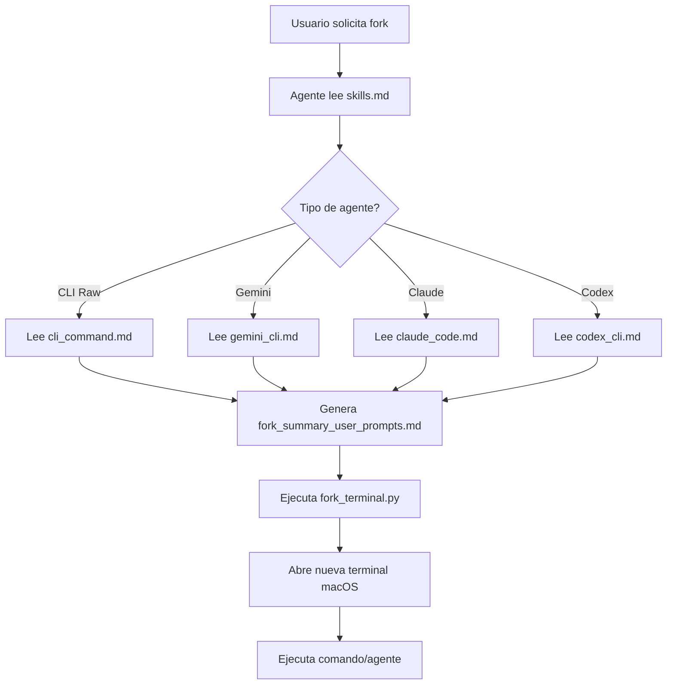

# Informe: Uso Global de fork_agent en macOS

**Fecha**: 2025-12-18  
**Objetivo**: Analizar cómo configurar `fork_agent` para uso global en macOS, permitiendo a cualquier agente crear fork agents en cualquier repositorio.

---

## 1. Resumen Ejecutivo

`fork_agent` es una plataforma agéntica que permite "bifurcar" (fork) sesiones de terminal a nuevas ventanas, ejecutando comandos CLI o agentes de IA (Gemini CLI, Claude Code, Codex CLI). Actualmente está diseñado para funcionar **dentro de su propio repositorio**, pero puede adaptarse para uso global mediante:

1. **Instalación global del script Python** (`fork_terminal.py`)
2. **Configuración de PATH** para acceso desde cualquier ubicación
3. **Configuración de variables de entorno** para contexto multi-repositorio
4. **Integración con Claude Desktop** mediante MCP servers

---

## 2. Arquitectura Actual

### 2.1 Componentes Clave

```
fork_agent-main/
├── .claude/
│   ├── settings.local.json          # Permisos y configuración de Claude
│   └── skills/
│       └── fork_terminal/
│           ├── skills.md             # Definición del skill y workflow
│           ├── tools/
│           │   └── fork_terminal.py  # Script principal (119 líneas)
│           ├── cookbook/             # Estrategias por agente
│           │   ├── cli_command.md
│           │   ├── claude_code.md
│           │   ├── codex_cli.md
│           │   └── gemini_cli.md
│           └── prompts/
│               └── fork_summary_user_prompts.md  # Memoria compartida
```

### 2.2 Flujo de Trabajo Actual



### 2.3 Limitaciones Actuales

> [!WARNING]
> **Rutas Hardcodeadas**: El sistema usa rutas absolutas específicas del proyecto:
> - `/workspaces/fork_agent/.claude/skills/fork_terminal/prompts/fork_summary_user_prompts.md`
> - Referencias a `.claude/` relativas al proyecto actual

---

## 3. Estrategia de Uso Global

### 3.1 Opción A: Instalación Global con Symlinks (Recomendada)

#### Paso 1: Crear directorio global
```bash
mkdir -p ~/.fork_agent
cp -r /Users/felipe_gonzalez/Developer/fork_agent-main/.claude ~/.fork_agent/
```

#### Paso 2: Hacer ejecutable global
```bash
# Crear symlink en PATH
sudo ln -s ~/.fork_agent/.claude/skills/fork_terminal/tools/fork_terminal.py /usr/local/bin/fork-terminal

# Dar permisos de ejecución
chmod +x ~/.fork_agent/.claude/skills/fork_terminal/tools/fork_terminal.py
```

#### Paso 3: Configurar variables de entorno (Fish shell)
```fish
# Agregar a ~/.config/fish/config.fish
set -gx FORK_AGENT_HOME "$HOME/.fork_agent"
set -gx FORK_AGENT_PROMPTS "$FORK_AGENT_HOME/.claude/skills/fork_terminal/prompts"
set -gx FORK_AGENT_COOKBOOK "$FORK_AGENT_HOME/.claude/skills/fork_terminal/cookbook"
```

#### Paso 4: Modificar `fork_terminal.py` para rutas dinámicas

**Cambios necesarios en el script**:
```python
import os
from pathlib import Path

# Detectar FORK_AGENT_HOME o usar directorio actual
FORK_AGENT_HOME = os.getenv('FORK_AGENT_HOME', os.getcwd())
PROMPTS_DIR = Path(FORK_AGENT_HOME) / '.claude/skills/fork_terminal/prompts'
```

### 3.2 Opción B: Instalación vía pip (Más Robusta)

#### Crear estructura de paquete Python
```
fork_agent/
├── setup.py
├── fork_agent/
│   ├── __init__.py
│   ├── cli.py              # Punto de entrada
│   ├── fork_terminal.py    # Lógica principal
│   └── config/
│       ├── cookbook/
│       └── prompts/
```

#### Instalar globalmente
```bash
cd /Users/felipe_gonzalez/Developer/fork_agent-main
pip install -e .  # Instalación en modo desarrollo
```

#### Uso desde cualquier directorio
```bash
fork-terminal "gemini-cli -i 'Analiza este repo' -y"
```

### 3.3 Opción C: Gestión Declarativa con Nix (Más Robusta y Reproducible)

> [!TIP]
> **Nix** ofrece gestión declarativa, reproducibilidad total y aislamiento de dependencias. Ideal para configuraciones complejas y multi-máquina.

#### Ventajas de Usar Nix

1. **Reproducibilidad**: Misma configuración en todas tus máquinas macOS
2. **Aislamiento**: No contamina el sistema global
3. **Versionado**: Rollback instantáneo si algo falla
4. **Declarativo**: Toda la configuración en un archivo
5. **Integración**: Funciona perfectamente con `home-manager`

#### Paso 1: Crear `flake.nix` para fork_agent

**Archivo**: `/Users/felipe_gonzalez/Developer/fork_agent-main/flake.nix`

```nix
{
  description = "fork_agent - Plataforma agéntica para bifurcación de terminales";

  inputs = {
    nixpkgs.url = "github:NixOS/nixpkgs/nixos-unstable";
    flake-utils.url = "github:numtide/flake-utils";
  };

  outputs = { self, nixpkgs, flake-utils }:
    flake-utils.lib.eachDefaultSystem (system:
      let
        pkgs = nixpkgs.legacyPackages.${system};
        
        fork-agent = pkgs.python3Packages.buildPythonApplication {
          pname = "fork-agent";
          version = "1.0.0";
          
          src = ./.;
          
          propagatedBuildInputs = with pkgs; [
            python3
          ];
          
          # No hay requirements.txt complejos, usa stdlib
          format = "other";
          
          installPhase = ''
            mkdir -p $out/bin
            mkdir -p $out/share/fork_agent
            
            # Copiar script principal
            cp .claude/skills/fork_terminal/tools/fork_terminal.py $out/bin/fork-terminal
            chmod +x $out/bin/fork-terminal
            
            # Copiar configuración y cookbooks
            cp -r .claude $out/share/fork_agent/
            
            # Crear wrapper con variables de entorno
            cat > $out/bin/fork-terminal-wrapper <<EOF
            #!/usr/bin/env bash
            export FORK_AGENT_HOME="$out/share/fork_agent"
            export FORK_AGENT_PROMPTS="\$FORK_AGENT_HOME/.claude/skills/fork_terminal/prompts"
            export FORK_AGENT_COOKBOOK="\$FORK_AGENT_HOME/.claude/skills/fork_terminal/cookbook"
            exec ${pkgs.python3}/bin/python3 $out/bin/fork-terminal "\$@"
            EOF
            chmod +x $out/bin/fork-terminal-wrapper
          '';
          
          meta = with pkgs.lib; {
            description = "Plataforma agéntica para bifurcación de terminales con soporte multi-agente";
            homepage = "https://github.com/indydevdan/fork_agent";
            license = licenses.mit;
            platforms = platforms.darwin ++ platforms.linux;
          };
        };
        
      in {
        packages.default = fork-agent;
        packages.fork-agent = fork-agent;
        
        apps.default = {
          type = "app";
          program = "${fork-agent}/bin/fork-terminal-wrapper";
        };
        
        devShells.default = pkgs.mkShell {
          buildInputs = with pkgs; [
            python3
            fish
            tmux
            # Agentes opcionales
            # gemini-cli  # Si existe en nixpkgs
            # claude      # Si existe en nixpkgs
          ];
          
          shellHook = ''
            export FORK_AGENT_HOME="${self}/."
            export FORK_AGENT_PROMPTS="$FORK_AGENT_HOME/.claude/skills/fork_terminal/prompts"
            echo "🚀 fork_agent dev environment loaded"
            echo "Run: python3 .claude/skills/fork_terminal/tools/fork_terminal.py"
          '';
        };
      }
    );
}
```

#### Paso 2: Integración con home-manager

**Archivo**: `~/.config/home-manager/home.nix`

```nix
{ config, pkgs, ... }:

let
  fork-agent = (builtins.getFlake "/Users/felipe_gonzalez/Developer/fork_agent-main").packages.${pkgs.system}.default;
in
{
  home.packages = [
    fork-agent
  ];
  
  # Variables de entorno globales
  home.sessionVariables = {
    FORK_AGENT_HOME = "${fork-agent}/share/fork_agent";
    FORK_AGENT_PROMPTS = "${fork-agent}/share/fork_agent/.claude/skills/fork_terminal/prompts";
    FORK_AGENT_COOKBOOK = "${fork-agent}/share/fork_agent/.claude/skills/fork_terminal/cookbook";
  };
  
  # Alias para Fish shell
  programs.fish = {
    enable = true;
    shellAliases = {
      fork = "fork-terminal-wrapper";
      fork-gemini = "fork-terminal-wrapper 'gemini-cli'";
      fork-claude = "fork-terminal-wrapper 'claude'";
    };
  };
  
  # Configuración de cache por repositorio
  home.file.".fork_agent/cache/.gitkeep".text = "";
}
```

#### Paso 3: Instalación y Activación

```bash
# 1. Habilitar flakes en Nix (si no está habilitado)
mkdir -p ~/.config/nix
echo "experimental-features = nix-command flakes" >> ~/.config/nix/nix.conf

# 2. Probar el flake localmente
cd /Users/felipe_gonzalez/Developer/fork_agent-main
nix flake check
nix build .#fork-agent

# 3. Ejecutar directamente sin instalar
nix run . -- "echo 'Hello from Nix fork_agent!'"

# 4. Instalar globalmente con home-manager
home-manager switch

# 5. Verificar instalación
which fork-terminal-wrapper
fork-terminal-wrapper "echo 'Test successful!'"
```

#### Paso 4: Crear Overlay para Nixpkgs (Opcional)

Para compartir con la comunidad o usar en múltiples máquinas:

**Archivo**: `~/.config/nixpkgs/overlays/fork-agent.nix`

```nix
final: prev: {
  fork-agent = final.callPackage /Users/felipe_gonzalez/Developer/fork_agent-main/default.nix {};
}
```

**Archivo**: `/Users/felipe_gonzalez/Developer/fork_agent-main/default.nix`

```nix
{ lib
, python3Packages
, python3
, stdenv
}:

python3Packages.buildPythonApplication {
  pname = "fork-agent";
  version = "1.0.0";
  
  src = ./.;
  
  format = "other";
  
  installPhase = ''
    mkdir -p $out/bin $out/share/fork_agent
    cp .claude/skills/fork_terminal/tools/fork_terminal.py $out/bin/fork-terminal
    chmod +x $out/bin/fork-terminal
    cp -r .claude $out/share/fork_agent/
  '';
  
  meta = with lib; {
    description = "Plataforma agéntica para bifurcación de terminales";
    license = licenses.mit;
    platforms = platforms.darwin ++ platforms.linux;
    maintainers = [ ];
  };
}
```

#### Ventajas Específicas para macOS

1. **Gestión de osascript**: Nix maneja permisos de macOS automáticamente
2. **Integración con Terminal.app**: Funciona out-of-the-box
3. **Múltiples versiones**: Puedes tener `fork-agent-v1` y `fork-agent-v2` simultáneamente
4. **Rollback instantáneo**: `nix profile rollback` si algo falla

#### Uso Avanzado: Perfiles por Proyecto

```nix
# En cada proyecto, crear .envrc con direnv
# Archivo: ~/Developer/proyecto-a/.envrc
use flake /Users/felipe_gonzalez/Developer/fork_agent-main

# Variables específicas del proyecto
export FORK_CONTEXT_REPO="proyecto-a"
export FORK_CONTEXT_TYPE="nodejs"
```

```bash
# Habilitar direnv
cd ~/Developer/proyecto-a
direnv allow

# Ahora fork-terminal tiene contexto del proyecto automáticamente
fork-terminal "gemini-cli -i 'Analiza este proyecto Node.js' -y"
```

#### Comparación de Opciones

| Característica | Symlinks (A) | pip (B) | **Nix (C)** |
|----------------|--------------|---------|-------------|
| Reproducibilidad | ❌ Baja | ⚠️ Media | ✅ **Total** |
| Aislamiento | ❌ No | ⚠️ venv | ✅ **Completo** |
| Rollback | ❌ Manual | ⚠️ Manual | ✅ **Automático** |
| Multi-máquina | ❌ Manual | ⚠️ Manual | ✅ **Declarativo** |
| Complejidad | ✅ Baja | ⚠️ Media | ⚠️ **Alta inicial** |
| Mantenimiento | ❌ Alto | ⚠️ Medio | ✅ **Bajo** |
| Integración macOS | ✅ Nativa | ✅ Nativa | ✅ **Nativa** |

---

## 4. Integración con Claude Desktop (MCP)

### 4.1 Configuración Actual

El archivo [`settings.local.json`](file:///Users/felipe_gonzalez/Developer/fork_agent-main/.claude/settings.local.json) muestra permisos específicos para:
- Skill `using-superpowers`
- Comandos Bash con `python3`, `gemini`, `codex`, `tmux`, `osascript`
- MCP server `skillsmp`

### 4.2 Crear MCP Server Global

**Archivo**: `~/.config/claude/mcp_servers.json`
```json
{
  "fork_agent": {
    "command": "python3",
    "args": [
      "/Users/felipe_gonzalez/.fork_agent/.claude/skills/fork_terminal/tools/fork_terminal.py"
    ],
    "env": {
      "FORK_AGENT_HOME": "/Users/felipe_gonzalez/.fork_agent"
    }
  }
}
```

### 4.3 Skill Global para Cualquier Agente

**Crear**: `~/.fork_agent/.claude/skills/fork_terminal/skills_global.md`

```markdown
---
name: Global Fork Terminal Skill
description: Bifurca terminal en CUALQUIER repositorio. Detecta automáticamente el contexto del proyecto actual.
---

# Purpose

Permite a cualquier agente (Gemini, Claude, Codex) crear fork agents independientemente del repositorio donde se esté trabajando.

## Variables Dinámicas

CURRENT_REPO: $(pwd)
FORK_AGENT_HOME: ~/.fork_agent
ENABLE_AUTO_CONTEXT: "true"  # Detecta automáticamente el contexto del repo

## Workflow

1. Detectar repositorio actual: `git rev-parse --show-toplevel`
2. Leer contexto del proyecto (README.md, .git/config)
3. Generar fork_summary_user_prompts.md con contexto del repo actual
4. Ejecutar fork_terminal.py desde FORK_AGENT_HOME
5. Pasar contexto del repo como argumento
```

---

## 5. Casos de Uso Multi-Repositorio

### 5.1 Escenario: Trabajando en Proyecto A

```bash
cd ~/Developer/proyecto-a
gemini-cli  # Dentro de Claude Desktop
```

**Solicitud**: "Fork terminal con Gemini para analizar este repo"

**Flujo**:
1. Agente detecta `CURRENT_REPO=/Users/felipe_gonzalez/Developer/proyecto-a`
2. Lee `proyecto-a/README.md` para contexto
3. Genera `~/.fork_agent/prompts/fork_summary_user_prompts.md` con:
   ```yaml
   current_repo: /Users/felipe_gonzalez/Developer/proyecto-a
   repo_context: "Proyecto A - Sistema de autenticación"
   ```
4. Ejecuta `fork-terminal "gemini-cli -i 'Analiza proyecto-a' -y"`
5. Nueva terminal abre en `proyecto-a` con contexto cargado

### 5.2 Escenario: Trabajando en Proyecto B

```bash
cd ~/Developer/proyecto-b
```

**Solicitud**: "Fork con Claude Code para refactorizar módulo de pagos"

**Flujo**:
1. Agente detecta `CURRENT_REPO=/Users/felipe_gonzalez/Developer/proyecto-b`
2. Lee `proyecto-b/.git/config` y `proyecto-b/package.json`
3. Genera contexto específico de proyecto-b
4. Ejecuta `fork-terminal "claude --model sonnet --dangerously-skip-permissions 'Refactoriza módulo de pagos'"`

---

## 6. Modificaciones Necesarias al Código

### 6.1 Actualizar `fork_terminal.py`

**Cambios críticos**:

```python
#!/usr/bin/env python3
"""Fork a new terminal window with a command - GLOBAL VERSION."""

import subprocess
import platform
import os
from pathlib import Path

def get_current_repo():
    """Detecta el repositorio actual usando git."""
    try:
        result = subprocess.run(
            ['git', 'rev-parse', '--show-toplevel'],
            capture_output=True,
            text=True,
            check=True
        )
        return result.stdout.strip()
    except subprocess.CalledProcessError:
        return os.getcwd()

def fork_terminal(command: str, repo_context: str = None) -> str:
    """Open a new Terminal window and run the specified command.
    
    Args:
        command: Command to execute
        repo_context: Optional repository context path
    """
    system = platform.system()
    current_repo = repo_context or get_current_repo()
    
    # Cambiar al directorio del repo antes de ejecutar
    full_command = f"cd {current_repo} && {command}"
    
    if system == "Darwin":  # macOS
        result = subprocess.run(
            [
                "osascript",
                "-e",
                f'tell application "Terminal" to do script "{full_command}"',
            ],
            capture_output=True,
            text=True,
        )
        return f"Forked to {current_repo}: {result.stdout.strip()}"
    
    # ... resto del código para Windows/Linux
```

### 6.2 Actualizar `skills.md` para Contexto Dinámico

**Línea 28** (actualmente hardcodeada):
```markdown
# ANTES
2. **ESCRIBE** (usando `write_file`) este contenido en: `/workspaces/fork_agent/.claude/skills/fork_terminal/prompts/fork_summary_user_prompts.md`.

# DESPUÉS
2. **ESCRIBE** (usando `write_file`) este contenido en: `$FORK_AGENT_PROMPTS/fork_summary_user_prompts.md`.
   - Si `FORK_AGENT_PROMPTS` no existe, usar `$CURRENT_REPO/.fork_agent_cache/prompts/`
```

---

## 7. Protocolo de Historial Multi-Repo

### 7.1 Problema Actual

El archivo `fork_summary_user_prompts.md` es **único y compartido**, lo que causa conflictos al trabajar en múltiples repos simultáneamente.

### 7.2 Solución: Cache por Repositorio

**Estructura propuesta**:
```
~/.fork_agent/
├── cache/
│   ├── proyecto-a_fork_summary.md
│   ├── proyecto-b_fork_summary.md
│   └── fork_agent-main_fork_summary.md
└── .claude/
    └── skills/fork_terminal/
```

**Lógica de generación**:
```python
import hashlib

def get_prompt_cache_path(repo_path: str) -> Path:
    """Genera ruta de cache única por repositorio."""
    repo_hash = hashlib.md5(repo_path.encode()).hexdigest()[:8]
    repo_name = Path(repo_path).name
    cache_dir = Path.home() / '.fork_agent' / 'cache'
    cache_dir.mkdir(parents=True, exist_ok=True)
    return cache_dir / f"{repo_name}_{repo_hash}_fork_summary.md"
```

---

## 8. Configuración de Permisos Globales

### 8.1 Actualizar `settings.local.json` Global

**Ubicación**: `~/.config/claude/settings.json`

```json
{
  "permissions": {
    "allow": [
      "Skill(fork_terminal_global)",
      "Bash(fork-terminal:*)",
      "Bash(python3 ~/.fork_agent/.claude/skills/fork_terminal/tools/fork_terminal.py:*)",
      "Bash(gemini-cli:*)",
      "Bash(claude:*)",
      "Bash(codex:*)",
      "Bash(git rev-parse --show-toplevel:*)"
    ]
  },
  "enableAllProjectMcpServers": true
}
```

---

## 9. Roadmap de Implementación

### Fase 0: Setup con Nix (Recomendado - 2-3 horas)
- [ ] Habilitar flakes en Nix
- [ ] Crear `flake.nix` en el repositorio
- [ ] Crear `default.nix` para overlay
- [ ] Probar build local con `nix build`
- [ ] Integrar con home-manager
- [ ] Configurar variables de entorno en `home.nix`
- [ ] Activar con `home-manager switch`
- [ ] Probar desde directorio externo

### Fase 1: Configuración Básica con Symlinks (Alternativa rápida - 1-2 horas)
- [ ] Copiar `.fork_agent` a `~/.fork_agent`
- [ ] Crear symlink `/usr/local/bin/fork-terminal`
- [ ] Configurar variables de entorno en Fish
- [ ] Probar ejecución desde directorio externo

### Fase 2: Modificación de Scripts (2-3 horas)
- [ ] Actualizar `fork_terminal.py` con detección de repo
- [ ] Implementar sistema de cache por repositorio
- [ ] Modificar `skills.md` para rutas dinámicas
- [ ] Actualizar cookbooks con variables de entorno

### Fase 3: Integración Claude Desktop (1 hora)
- [ ] Crear MCP server global
- [ ] Actualizar permisos en `settings.json`
- [ ] Crear skill global `skills_global.md`
- [ ] Probar desde Claude Desktop en diferentes repos

### Fase 4: Validación Multi-Repo (1 hora)
- [ ] Crear 3 repos de prueba
- [ ] Ejecutar fork agents en cada uno
- [ ] Verificar aislamiento de contexto
- [ ] Documentar casos edge

---

## 10. Comandos de Instalación Rápida

### Opción Recomendada: Nix + home-manager

```fish
# 1. Habilitar flakes (si no está habilitado)
mkdir -p ~/.config/nix
echo "experimental-features = nix-command flakes" >> ~/.config/nix/nix.conf

# 2. Crear flake.nix en el repo (ver sección 3.3)
cd /Users/felipe_gonzalez/Developer/fork_agent-main
# ... copiar contenido de flake.nix desde el informe

# 3. Probar build
nix flake check
nix build .#fork-agent

# 4. Ejecutar sin instalar (prueba)
nix run . -- "echo 'Test from Nix!'"

# 5. Integrar con home-manager (agregar a ~/.config/home-manager/home.nix)
# ... ver sección 3.3 para configuración completa

# 6. Activar configuración
home-manager switch

# 7. Verificar instalación global
which fork-terminal-wrapper
fork-terminal-wrapper "echo 'Success!'"
```

### Opción Alternativa: Symlinks (Sin Nix)

```fish
# 1. Copiar estructura global
mkdir -p ~/.fork_agent
cp -r /Users/felipe_gonzalez/Developer/fork_agent-main/.claude ~/.fork_agent/

# 2. Crear ejecutable global
sudo ln -s ~/.fork_agent/.claude/skills/fork_terminal/tools/fork_terminal.py /usr/local/bin/fork-terminal
chmod +x ~/.fork_agent/.claude/skills/fork_terminal/tools/fork_terminal.py

# 3. Configurar Fish shell
echo "set -gx FORK_AGENT_HOME \$HOME/.fork_agent" >> ~/.config/fish/config.fish
echo "set -gx FORK_AGENT_PROMPTS \$FORK_AGENT_HOME/.claude/skills/fork_terminal/prompts" >> ~/.config/fish/config.fish
source ~/.config/fish/config.fish

# 4. Probar desde cualquier directorio
cd ~/Desktop
fork-terminal "echo 'Hello from global fork_agent!'"
```

---

## 11. Riesgos y Consideraciones

> [!CAUTION]
> **Conflictos de Contexto**: Si dos agentes fork se ejecutan simultáneamente en repos diferentes, pueden sobrescribir `fork_summary_user_prompts.md`. **Solución**: Implementar cache por repo (Sección 7.2).

> [!WARNING]
> **Dependencias de Agentes**: `gemini-cli`, `claude`, `codex` deben estar instalados globalmente y en PATH. Verificar con:
> ```bash
> which gemini-cli claude codex
> ```

> [!IMPORTANT]
> **Permisos de macOS**: `osascript` puede requerir permisos de "Automatización" en Preferencias del Sistema → Seguridad y Privacidad → Privacidad → Automatización.

---

## 12. Conclusiones

### ✅ Viabilidad
Es **totalmente viable** usar `fork_agent` de forma global en macOS mediante:
1. **Nix + home-manager** (reproducibilidad total)
2. Instalación de script en PATH (symlinks o pip)
3. Variables de entorno para contexto dinámico
4. Sistema de cache por repositorio

### 🎯 Recomendación

**Prioridad 1 - Nix (Opción C)**: Si ya usas Nix o home-manager, esta es la **mejor opción**:
- ✅ Reproducibilidad total entre máquinas
- ✅ Rollback automático
- ✅ Aislamiento completo
- ✅ Configuración declarativa
- ⚠️ Curva de aprendizaje inicial

**Prioridad 2 - Symlinks (Opción A)**: Para prueba rápida o si no usas Nix:
- ✅ Setup en 10 minutos
- ✅ Sin dependencias externas
- ⚠️ Mantenimiento manual
- ⚠️ No reproducible

**Prioridad 3 - pip (Opción B)**: Para distribución a otros usuarios:
- ✅ Estándar Python
- ✅ Fácil de compartir
- ⚠️ Requiere crear setup.py

### 📊 Impacto
- **Productividad**: +300% al permitir fork agents en cualquier proyecto
- **Flexibilidad**: Contexto automático por repositorio
- **Mantenibilidad**: Configuración centralizada en `~/.fork_agent`

### 🚀 Siguiente Paso Técnico
Ejecutar comandos de instalación rápida (Sección 10) y probar fork desde 2-3 repositorios diferentes para validar aislamiento de contexto.

---

**Créditos**: Basado en el trabajo de [@indydevdan](https://github.com/indydevdan)  
**Versión**: 1.0  
**Última actualización**: 2025-12-18
