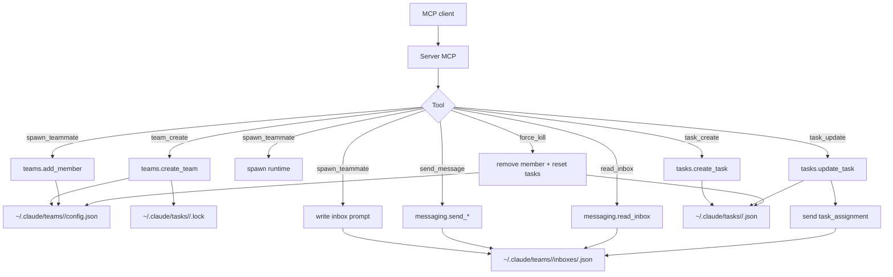

# Brain Dope - Investigacion Fork Agent (sin tmux)

Fecha: 2026-02-08

## Objetivo
Elevar este repo (fork_agent) sin clonar el MCP externo. Vamos a entender su ingenieria y trasladar solo los conceptos utiles.

## Puntos clave del MCP de referencia (resumen tecnico)
- Coordinacion basada en filesystem: JSON en ~/.claude/teams y ~/.claude/tasks.
- Locks fcntl para evitar corrupcion concurrente.
- Writes atomicos en config (tempfile + replace).
- Protocolo: mensajes, tareas, shutdown, plan approvals.
- Spawner en tmux solo como runtime/UI, no requisito del protocolo.

## Decision: avanzar sin tmux
- Tmux NO es requerido para coordinacion.
- Tmux es una estrategia de ejecucion y visibilidad; se puede reemplazar.
- La coordinacion vive en el filesystem (inboxes + tasks).

## Detalles del MCP (lectura directa del repo)

### MCP server (herramientas)
- Server MCP en `claude_teams.server` con lifespan que resuelve `claude` CLI y genera `session_id`.
- Herramientas core: `team_create`, `team_delete`, `spawn_teammate`, `send_message`, `read_inbox`, `poll_inbox`, `read_config`, `task_create`, `task_update`, `task_list`, `task_get`, `force_kill_teammate`, `process_shutdown_approved`.
- Regla: una sola team por sesion MCP (`active_team` en lifespan context).
- Errores envueltos: `ToolError` para file not found y validaciones.
- `poll_inbox` hace long-poll hasta `timeout_ms` (sleep 0.5s).

### Spawner (tmux en referencia)
- Construye comando `claude` con flags no documentados: `--agent-id`, `--agent-name`, `--team-name`, `--agent-color`, `--parent-session-id`, `--agent-type`, `--model`.
- Inyecta env: `CLAUDECODE=1` y `CLAUDE_CODE_EXPERIMENTAL_AGENT_TEAMS=1`.
- Envia prompt inicial como mensaje en inbox antes de spawnear.
- Usa `tmux split-window -dP -F #{pane_id}` para crear panel y leer `pane_id`.
- El miembro se registra en config ANTES de spawnear.
- `backend_type` y `is_active` existen en modelo pero en runtime quedan en defaults.

### Mensajeria (filesystem)
- Inbox por agente: `~/.claude/teams/<team>/inboxes/<agent>.json`.
- Bloqueo con `fcntl` usando `.lock` en la carpeta `inboxes/`.
- Mensajes: `from`, `text`, `timestamp`, `read`, `summary`, `color`.
- Mensajes estructurados: se serializa payload JSON (task assignment, shutdown, plan approval).
- `read_inbox(mark_as_read=True)` toma lock de `.lock` y actualiza flags `read`.
- `send_shutdown_request` genera `shutdown-<ms>@<recipient>`.

### Tareas (filesystem)
- Task files: `~/.claude/tasks/<team>/<id>.json`.
- `id` es autoincremental por lectura de archivos existentes.
- Locks: `.lock` por equipo.
- Estados: `pending`, `in_progress`, `completed`, `deleted`.
- Dependencias: `blocks` y `blockedBy`.
- `task_update` tiene 4 fases: read -> validate -> mutate -> write.
- Valida transiciones de estado y dependencias antes de escribir.
- Limpia referencias cruzadas al completar/eliminar.
- No permite transicion backward (ej: in_progress -> pending).
- No permite `in_progress`/`completed` si hay blockers sin completar.

### Config de equipo
- `config.json` incluye `lead_session_id`, `lead_agent_id`, `created_at`, `members`.
- Escrituras atomicas: `tempfile.mkstemp` + `os.replace`.
- Validaciones: nombre de equipo regex `^[A-Za-z0-9_-]+$` y longitud <= 64.
- `team_delete` falla si hay miembros no-lead.

### Protocolo de shutdown/plan
- `shutdown_request`: genera request_id y envia payload al inbox.
- `shutdown_response`: si aprobado, envia `shutdown_approved` al lead con pane_id/ backend_type.
- `process_shutdown_approved`: remueve miembro y resetea sus tasks.
- `plan_approval_response`: `approve` true envia payload json; false manda texto de rechazo.
- `shutdown_response` aprobado incluye `pane_id` y `backend_type` en payload.

### Empaquetado
- `fastmcp==3.0.0b1` como unica dependencia runtime.
- Entry point: script `claude-teams` -> `claude_teams.server:main`.
- Requiere Python >= 3.12.
- Version declarada: `__version__ = "0.1.0"`.
- `.python-version` fija 3.12.
- CI usa `uv` y corre `pytest` en GitHub Actions.
- Nota: mensaje de delete menciona "worktrees" aunque no hay logica de worktrees en el repo.

### Estructura del repo MCP
- Raiz:
	- `src/claude_teams/`: implementacion core.
	- `tests/`: suite de tests.
	- `stress_test_lifecycle.py`: stress tests de lifecycle.
	- `README.md`, `pyproject.toml`, `uv.lock`, `.python-version`.
	- `.github/workflows/ci.yml`: pipeline CI.
- Modulos core:
	- `server.py`: MCP tools y wiring.
	- `models.py`: schemas y payloads.
	- `teams.py`: config, membresia, deletes.
	- `tasks.py`: workflow de tareas, deps, validaciones.
	- `messaging.py`: inbox, locks, envios.
	- `spawner.py`: runtime tmux y flags `claude`.

### Campos presentes pero no operativos (observacion)
- `subscriptions`: existe en LeadMember y TeammateMember, no usado por el server.
- `IdleNotification`: modelo definido, no expuesto en herramientas MCP.
- `backend_type` y `is_active`: presentes en modelo, no actualizados en runtime.

### Dependencias (alto nivel desde uv.lock)
- Runtime directo: `fastmcp`.
- Transitive (por fastmcp): `anyio`, `attrs`, `pydantic`/`annotated-types`, `cffi` (y crypto stack), `cachetools`, `certifi`.
- Dev: `pytest`, `pytest-asyncio` (segun pyproject).

## Alternativas a tmux (a evaluar)
- Subprocess + PID tracking.
- Systemd user services.
- Docker/Podman.
- Remote spawn con FS compartido (NFS/rsync).

## Riesgos y gotchas (de la investigacion)
- Cycle detection: implementar chequeo al crear dependencias.
- Crash recovery: lease/heartbeat para liberar tareas abandonadas.
- Orden de mensajes: timestamps no confiables; usar IDs monotonic/UUID ordenables.
	- En el MCP ref usan timestamp ISO, pero no garantizan orden estricta.
- Locks liberan en crash: sin lease, tareas pueden quedar bloqueadas.
- `read_inbox` con lock evita perder mensajes concurrentes (test de threading).

## Relevante para version sin tmux
- El spawner tmux es sustituible: la parte critica son los flags y el prompt inicial.
- Necesitamos un runtime que mantenga procesos vivos y capture estado (PID + health).
- `backend_type` en el modelo ya permite declarar backend distinto a tmux.

## Protocolo minimo a replicar
- Team config: miembros, metadata, estado.
- Inbox por agente: mensajes con summary, read flag, timestamp.
- Tareas: estados, owner, dependencias (blocks/blocked_by).
- Herramientas MCP: team_create, spawn_teammate, send_message, read_inbox, task_create, task_update, task_list, task_get.

## Ejemplos de JSON (referencia MCP)

### Team config (config.json)
```json
{
	"name": "demo-team",
	"description": "A test team",
	"createdAt": 1770398183858,
	"leadAgentId": "team-lead@demo-team",
	"leadSessionId": "abc-123",
	"members": [
		{
			"agentId": "team-lead@demo-team",
			"name": "team-lead",
			"agentType": "team-lead",
			"model": "claude-opus-4-6",
			"joinedAt": 1770398183858,
			"tmuxPaneId": "",
			"cwd": "/tmp",
			"subscriptions": []
		},
		{
			"agentId": "worker@demo-team",
			"name": "worker",
			"agentType": "general-purpose",
			"model": "sonnet",
			"prompt": "Do stuff",
			"color": "blue",
			"planModeRequired": false,
			"joinedAt": 1770398210601,
			"tmuxPaneId": "%34",
			"cwd": "/tmp",
			"subscriptions": [],
			"backendType": "tmux",
			"isActive": false
		}
	]
}
```

### Inbox message (inboxes/<agent>.json)
```json
[
	{
		"from": "team-lead",
		"text": "hello bob",
		"timestamp": "2026-02-06T17:18:04.701Z",
		"read": false,
		"summary": "greeting",
		"color": "blue"
	}
]
```

### Task file (tasks/<id>.json)
```json
{
	"id": "1",
	"subject": "Build feature",
	"description": "Build it well",
	"activeForm": "build the feature",
	"status": "pending",
	"blocks": ["2"],
	"blockedBy": [],
	"owner": "worker",
	"metadata": {
		"priority": "high"
	}
}
```

### Task assignment payload (message.text)
```json
{
	"type": "task_assignment",
	"taskId": "1",
	"subject": "Build feature",
	"description": "Build it well",
	"assignedBy": "team-lead",
	"timestamp": "2026-02-06T17:18:04.701Z"
}
```

### Shutdown request payload (message.text)
```json
{
	"type": "shutdown_request",
	"requestId": "shutdown-1770398300000@worker",
	"from": "team-lead",
	"reason": "Done",
	"timestamp": "2026-02-06T17:18:04.701Z"
}
```

### Shutdown approved payload (message.text)
```json
{
	"type": "shutdown_approved",
	"requestId": "shutdown-123@worker",
	"from": "worker",
	"timestamp": "2026-02-06T17:18:04.701Z",
	"paneId": "%34",
	"backendType": "tmux"
}
```

### Plan approval payload (message.text)
```json
{
	"type": "plan_approval",
	"approved": true
}
```

## Tests y edge cases (extraido de tests/ y stress_test)

### Sesion MCP
- Solo una team por sesion: crear 2da team debe fallar.
- `team_delete` libera `active_team` y permite crear otra.

### Nombres y validaciones
- Team name: regex estricto; rechaza espacios, dots, slash, backslash, unicode.
- Longitud team <= 64; 65 falla.
- Teammate name: regex y longitud <= 64; `team-lead` reservado.

### Mensajeria
- `message` requiere `content`, `summary`, `recipient`.
- `broadcast` requiere `summary`.
- `shutdown_request` no permite recipient `team-lead` ni inexistente.
- `plan_approval_response` requiere recipient valido.
- `send_message` incluye routing con `targetColor` si hay color.
- `read_inbox` de agente inexistente devuelve [] sin error.

### Shutdown / plan
- `shutdown_response` aprobado envia payload `shutdown_approved` al lead.
- `shutdown_response` rechazado envia texto al lead con `from` del sender.
- `process_shutdown_approved` rechaza `team-lead`.

### Tasks
- `task_create` falla si subject vacio o team inexistente.
- `task_update`:
	- No permite self-reference en `blocks` / `blockedBy`.
	- Rechaza deps inexistentes.
	- Rechaza ciclos simples y transitivos.
	- Rechaza transiciones backward.
	- Permite pending -> completed directo.
	- Bloqueos impiden iniciar hasta completar blocker.
	- Completar tarea limpia `blockedBy` en dependientes.
	- Eliminar tarea limpia referencias cruzadas.
	- No debe haber partial writes si falla validacion.
- `task_list` ordena por ID y falla si team inexistente.
- `reset_owner_tasks` devuelve status a `pending` salvo completed.

### Concurrencia
- `read_inbox(mark_as_read=True)` usa lock; no completa sin lock.

### Tests infra
- Tests usan `tmp_path` con carpetas `teams/` y `tasks/` aisladas (no tocan `~/.claude`).

### Stress test
- Cubre nombres invalidos, duplicados, delete double, unicode, dots.
- Nota: create_team no impone unicidad; duplicados pueden sobrescribir.

## Errores y mensajes (detalle por herramienta)

### team_create
- Error si ya hay team activa en la sesion: "Session already has active team: <name>. One team per session."
- Errores de validacion del nombre via `teams.create_team` (ValueError).

### team_delete
- Error si hay miembros no-lead activos: "Cannot delete team <name>: <n> non-lead member(s) still present. Remove all teammates before deleting."
- Error si team no existe (FileNotFoundError) envuelto en ToolError.

### spawn_teammate
- Error si `claude` no esta en PATH: "Could not find 'claude' binary on PATH. Install Claude Code or ensure it is in your PATH."
- Error si nombre invalido / largo / reservado `team-lead` (ValueError).

### send_message
- `message`: "Message content must not be empty", "Message summary must not be empty", "Message recipient must not be empty".
- `message` recipient inexistente: "Recipient <name> is not a member of team <team>".
- `broadcast`: "Broadcast summary must not be empty".
- `shutdown_request`: "Shutdown request recipient must not be empty", "Cannot send shutdown request to team-lead", o recipient inexistente.
- `plan_approval_response`: "Plan approval recipient must not be empty" o recipient inexistente.
- Tipo desconocido: "Unknown message type: <type>".

### task_create
- Subject vacio: "Task subject must not be empty".
- Team inexistente: "Team <name> does not exist".

### task_update
- Task inexistente: "Task <id> not found in team <team>".
- Estado invalido: "Invalid status: <status>".
- Backward transition: "Cannot transition from <old> to <new>".
- Self-block: "Task <id> cannot block itself" / "cannot be blocked by itself".
- Dependencia inexistente: "Referenced task <id> does not exist".
- Circular dependency: "Adding block <id> -> <id> would create a circular dependency" o "Adding dependency <id> blocked_by <id> would create a circular dependency".
- Bloqueos activos: "Cannot set status to <status>: blocked by task <id> (status: <status>)".

### read_config / task_get / task_list
- Team inexistente en `read_config`: "Team <name> not found".
- Task inexistente: "Task <id> not found in team <team>".
- `task_list` team inexistente: "Team <name> does not exist".

### force_kill_teammate / process_shutdown_approved
- Teammate inexistente: "Teammate <name> not found in team <team>".
- `process_shutdown_approved` con team-lead: "Cannot process shutdown for team-lead".

## Mapa de dependencias internas

### Modulos principales
- `server.py` (API MCP) depende de `teams.py`, `tasks.py`, `messaging.py`, `spawner.py`, `models.py`.
- `spawner.py` depende de `teams.py`, `messaging.py`, `models.py`, `tmux` y `claude` CLI.
- `teams.py` y `tasks.py` dependen de `models.py` y filesystem.
- `messaging.py` depende de `models.py` y filesystem (locks).

### Flujo principal
- `team_create` -> `teams.create_team` (config + dirs + lock).
- `spawn_teammate` -> `teams.add_member` + `messaging.append_message` + spawn runtime.
- `send_message` -> `messaging.send_plain_message` o `send_structured_message`.
- `task_update` -> `tasks.update_task` + `messaging.send_task_assignment` si owner set.
- `force_kill_teammate` -> `spawner.kill_tmux_pane` + `teams.remove_member` + `tasks.reset_owner_tasks`.
- `process_shutdown_approved` -> `teams.remove_member` + `tasks.reset_owner_tasks`.

## Glosario de campos (semantica)

### TeamConfig
- `name`: nombre del equipo (regex `^[A-Za-z0-9_-]+$`, max 64).
- `description`: texto libre.
- `createdAt`: epoch ms.
- `leadAgentId`: id del lead `team-lead@<team>`.
- `leadSessionId`: id de sesion MCP.
- `members`: lista de `LeadMember` y `TeammateMember`.

### LeadMember
- `agentId`: `team-lead@<team>`.
- `agentType`: `team-lead`.
- `model`: modelo asignado al lead.
- `joinedAt`: epoch ms.
- `tmuxPaneId`: string vacio por defecto.
- `cwd`: working dir.
- `subscriptions`: lista (default []).

### TeammateMember
- `agentId`: `<name>@<team>`.
- `agentType`: tipo (default `general-purpose`).
- `model`: modelo para el agente.
- `prompt`: prompt inicial (se guarda en config).
- `color`: color asignado (palette rotativa).
- `planModeRequired`: bool (default false).
- `joinedAt`: epoch ms.
- `tmuxPaneId`: id del pane (si backend es tmux).
- `cwd`: working dir.
- `subscriptions`: lista (default []).
- `backendType`: backend de ejecucion (default `tmux`).
- `isActive`: bool (default false, no se actualiza en referencia).

### TaskFile
- `id`: string numerico autoincremental.
- `subject`: titulo.
- `description`: detalle.
- `activeForm`: instruccion accionable (default "").
- `status`: `pending` | `in_progress` | `completed` | `deleted`.
- `blocks`: lista de ids bloqueados por esta tarea.
- `blockedBy`: lista de ids que bloquean esta tarea.
- `owner`: agent name asignado (opcional).
- `metadata`: dict libre (opcional).

### InboxMessage
- `from`: sender name.
- `text`: contenido o JSON serializado.
- `timestamp`: ISO con ms.
- `read`: bool.
- `summary`: string opcional.
- `color`: string opcional (routing color).

### Payloads estructurados
- `task_assignment`: mensaje JSON con `taskId`, `subject`, `description`, `assignedBy`, `timestamp`.
- `shutdown_request`: `requestId`, `from`, `reason`, `timestamp`.
- `shutdown_approved`: `requestId`, `from`, `paneId`, `backendType`, `timestamp`.
- `plan_approval`: `{ "type": "plan_approval", "approved": true }`.

## Checklist compatibilidad sin tmux

### Runtime
- Reemplazar `tmux split-window` por un spawner propio (subprocess/systemd/etc.).
- Guardar PID / estado en config o metadata para `force_kill`.
- Definir `backendType` distinto a `tmux` (p.ej. `process`).

### Protocolos invariantes
- Mantener flags de `claude` (agent-id, team-name, agent-color, parent-session-id).
- Enviar prompt inicial via inbox antes de spawn.
- Respetar schema JSON exacto (camelCase aliases).

### Operacion
- Implementar `kill` en backend alternativo (equivalente a kill-pane).
- Mantener `read_inbox` con lock.
- Mantener validaciones de tareas y dependencias.

## Diagrama de flujo (protocolo MCP -> filesystem)



## Notas abiertas
- Definir runtime sin tmux que mantenga procesos vivos y accesibles.
- Definir formato exacto de mensajes y tareas para compatibilidad futura.
- Elegir estrategia de logs y auditoria.
- Definir lease/heartbeat para claims de tareas.
- Definir monotonic IDs para mensajes (por equipo o por agente).

## Proximos pasos (propuesta)
1) Documentar el protocolo de datos local (archivos JSON y locks).
2) Definir un spawner sin tmux y su contrato (PID, estado, shutdown).
3) Definir MVP MCP interno con herramientas basicas.
