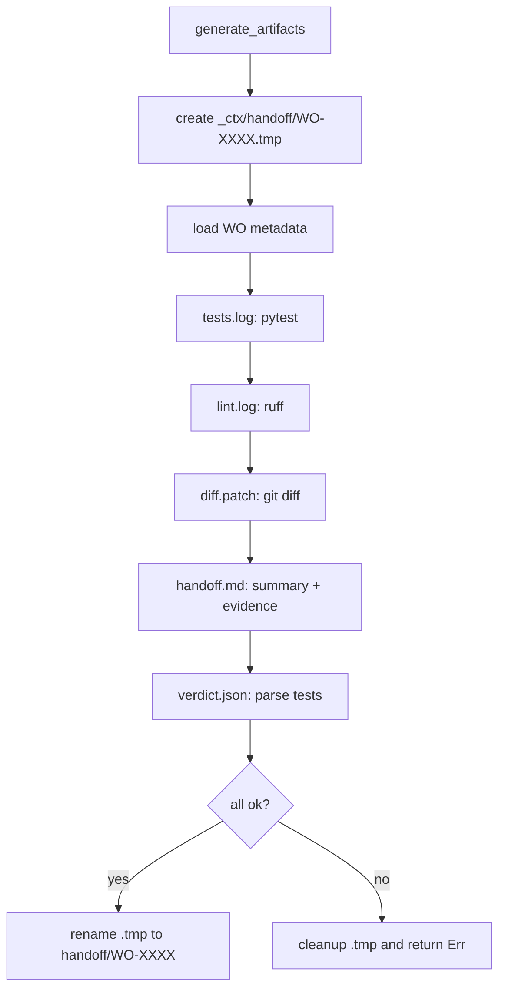

# Brain Dope - work_O

Fecha: 2026-02-08

## Objetivo
Capturar toda la informacion relevante de work_O para planificar mejoras.

## Resumen rapido
- Proyecto: wo-system (work order orchestration).
- Clean Architecture + FP boundaries.
- CLI con Typer, output con Rich.
- Config TOML + defaults hardcoded.
- Locking con fcntl + stale detection.

## Estructura del repo
- src/wo_system/
  - domain/ (result, wo_entities, wo_transactions)
  - application/ (wo_service, artifact_generator)
  - infrastructure/ (config, file_lock, checkpoint_system, github_client)
  - cli/ (main, output, github_helpers)
  - interfaces/ (vacio)
- scripts/
  - wo_take.sh, wo_finish.sh, wo_handoff.sh, wo_checkpoint.sh, wo_lib.sh
- docs/
  - architecture/ (ADR-0001)
  - plans/ (bootstrap, repo-config, clean-arch, TDD refactor, workflow analysis)

## Tooling y calidad
- Python >= 3.12
- uv + ruff + mypy + pytest + pyrefly + ty
- Makefile: venv, install, lint, test, type, type-canary
- CLI entry: wo = wo_system.cli.main:app

## Arquitectura declarada
- domain: puro, sin IO
- application: orquesta domain + infra
- infrastructure: IO (FS, GitHub, locks)
- ADR-0001: Clean Architecture + FP boundaries (domain sin infra, testing aislado)

## Dominio
- Result monad: Ok/Err + map/and_then
- WorkOrder:
  - id: WO-#### (regex)
  - states: pending, running, done, failed, partial
  - priority: critical, high, medium, low
  - invariants: no self-deps, timestamps consistentes
- Governance.must valida IDs WO-####

## Configuracion
- Config via config/settings.toml o WO_CONFIG_DIR
- Defaults: _ctx/jobs/{pending,running,done,failed}, handoff, logs
- worktree_parent: .worktrees
- max_concurrent_wos, lock_timeout_seconds, base_branch

### Loader real
- `load_config()` permite defaults TOML + overrides en settings.toml
- `get_config_path()` prioriza `WO_CONFIG_DIR/settings.toml`
- `Config.__post_init__` valida positivos en `max_concurrent_wos` y `lock_timeout_seconds`
- En CLI actual se usa `Config()` directo (no carga settings.toml) -> posible gap

## Ejemplos (TOML/YAML)

### settings.toml (override defaults)
```toml
# Example settings.toml
max_concurrent_wos = 5
lock_timeout_seconds = 1800
base_branch = "main"
worktree_parent = ".worktrees"

ctx_dir = "_ctx"
jobs_pending = "_ctx/jobs/pending"
jobs_running = "_ctx/jobs/running"
jobs_done = "_ctx/jobs/done"
jobs_failed = "_ctx/jobs/failed"
logs_dir = "_ctx/logs"
handoff_dir = "_ctx/handoff"
```

### WO YAML (pending)
```yaml
id: WO-0001
epic_id: EPIC-001
title: Integration Test WO
priority: high
status: pending
dod_id: DOD-001
dependencies: []
```

### WO YAML (running)
```yaml
id: WO-0001
epic_id: EPIC-001
title: Integration Test WO
priority: high
status: running
dod_id: DOD-001
dependencies: []
owner: testuser
started_at: "2026-02-08T10:30:00+00:00"
branch: "wo/wo-0001"
worktree: ".worktrees/wo-0001"
```

### WO YAML (running + checkpoints)
```yaml
id: WO-0001
epic_id: EPIC-001
title: Integration Test WO
priority: high
status: running
dod_id: DOD-001
dependencies: []
owner: testuser
started_at: "2026-02-08T10:30:00+00:00"
checkpoints:
  - timestamp: "2026-02-08T10:35:00+00:00"
    message: "Initial setup"
  - timestamp: "2026-02-08T10:50:00+00:00"
    message: "Implemented core feature"
```

### Handoff artifacts (examples)
Handoff dir: `_ctx/handoff/WO-0001/`

**handoff.md**
```md
# Handoff: WO-0001

## Summary
Test objective for WO-0001

## Evidence

- Task 1: Evidence 1
```

**verdict.json**
```json
{
  "wo_id": "WO-0001",
  "status": "done",
  "generated_at": "2026-02-08T11:05:00+00:00",
  "tests_passed": true,
  "failing_tests": [],
  "lint_passed": true,
  "artifact_verification": "complete",
  "notes": "DoD verification for WO-0001"
}
```

## Extensiones de schema (WO YAML)
Campos usados por `ArtifactGenerator` para armar handoff:
- `x_objective`: string, resumen objetivo (summary)
- `x_micro_tasks`: lista de objetos
  - `name`: string (nombre de tarea)
  - `status`: string (ej: done/pending)
  - `evidence`: string o lista de strings (opcional)

Ejemplo minimo:
```yaml
x_objective: "Test objective for WO-0001"
x_micro_tasks:
  - name: "Task 1"
    status: "done"
    evidence:
      - "Evidence 1"
  - name: "Task 2"
    status: "pending"
```

## Flujo de artifacts (resumen)
- `generate_artifacts`: crea dir temporal `.tmp` -> genera logs -> renombra atomico
- `tests.log`: `uv run pytest -m "not slow" -v` (timeout 300s)
- `lint.log`: `uv run ruff check src/` (timeout 60s)
- `diff.patch`: `git diff <base_branch>` (timeout 30s)
- `handoff.md`: resumen + evidence de `x_micro_tasks`
- `verdict.json`: parse de `tests.log` y flags DoD

## Mermaid: flujo de artifacts


## Locking
- FileLock con fcntl
- Guarda JSON con holder, acquired_at, pid
- stale detection por edad (default 3600s)
- timeout + retry

## WOService (core)
- take_wo:
  - Lee WO en pending
  - Valida WO y deps (salvo --force)
  - Lock en running
  - Actualiza owner/status/started_at
  - Genera branch y worktree path (solo metadata)
  - Mueve YAML a running con write atomico
- finish_wo:
  - Lee WO en running
  - Actualiza status/finished_at
  - Mueve a done/failed
  - Libera lock (borra archivo)
- list_wos: lee por estado, valida, ordena por id
- get_wo: busca en pending/running/done/failed

### Parse/validaciones WO
- required: `id`, `dod_id`, `title`, `priority`, `status`
- `id`: string non-empty; patron WO-#### validado en `WorkOrder.__post_init__`
- `dod_id`, `title`: string non-empty
- `priority`: enum critical/high/medium/low
- `status`: enum pending/running/done/failed/partial
- `dependencies` y `run_ids`: list/tuple -> tuple
- timestamps: `started_at`, `finished_at` ISO 8601
- optional: `epic_id`, `owner`, `branch`, `worktree`

### Branch/worktree
- Branch generado: `wo/{wo_id.lower()}`
- Worktree path: `<repo>/.worktrees/{wo_id.lower()}` (solo metadata)

## CheckpointSystem
- validate_message: no vacio, max 200, sanitiza newlines
- add_checkpoint: lock + append en YAML
- list_checkpoints: devuelve Result

## Locking
- `FileLock` usa `fcntl` con lock exclusivo no bloqueante
- Guarda JSON con `holder`, `acquired_at`, `pid`
- Detecta stale locks por edad (`stale_age_seconds`, default 3600)
- Retry loop con backoff fijo 0.1s hasta `timeout_seconds`
- Al liberar: `LOCK_UN` + cleanup de lock file

## CLI
- Comandos WO: take, finish, get, list
- Checkpoints: checkpoint add/list
- Artifacts: artifacts generate/validate
- GitHub: github push/pr (via GitHubClient)
- Handoff: workflow end-to-end (artifacts -> push -> PR)
- Owner se resuelve por flag o env WO_OWNER
- CLI crea config con `Config()` directo (no lee settings.toml)

### Mapa CLI -> servicios
- `wo take`: `WOService.take_wo`
- `wo finish`: `WOService.finish_wo`
- `wo get`: `WOService.get_wo`
- `wo list`: `WOService.list_wos`
- `wo checkpoint add`: `CheckpointSystem.add_checkpoint`
- `wo checkpoint list`: `CheckpointSystem.list_checkpoints`
- `wo artifacts generate`: `ArtifactGenerator.generate_artifacts`
- `wo artifacts validate`: `ArtifactGenerator.validate_dod`
- `wo github push`: `GitHubClient.push_branch`
- `wo github pr`: `GitHubClient.create_pr`
- `wo handoff`: artifacts -> `WOService.get_wo` -> `GitHubClient.push_branch` -> `GitHubClient.create_pr_from_file`

## Transacciones (domain)
- `Transaction` y `RollbackOperation` definen tipos de rollback (lock, move, worktree, branch)
- No se usan en `WOService` actual (placeholder para future recovery)

## Tests clave (infra/config/lock)
- `load_config` soporta defaults TOML + settings.toml + hardcoded defaults
- `ConfigError` en TOML invalido o valores fuera de rango
- `FileLock` tests: retry, timeout, stale detection, cleanup

## Tests CLI/scripts
- `test_shell_scripts.py`: valida formato WO-#### en wrappers bash
- `test_output.py`: `save_output` verifica write y falla si no existe el archivo
- `test_github_client.py`: valida gh available/auth, push/pr, y seguridad (no shell=True)

## GitHub (gh CLI)
- `GitHubClient` envuelve `gh` y `git` con `subprocess.run` (sin `shell=True`)
- `check_availability`: `gh --version` (timeout 5s)
- `check_auth`: `gh auth status` (timeout 5s)
- `push_branch`: `git push origin <branch>` (timeout 60s)
- `create_pr`: `gh pr create --base --head --title --body` (timeout 30s)
- `create_pr_from_file`: lee `handoff.md` y llama `create_pr`
- `push_and_create_pr`: push -> create PR (fail-fast en push)
- `_extract_pr_url`: busca `https://github.com/.../pull/...` en stdout

### Errores y modos de fallo
- `gh` no instalado/autenticado => `validate_github_client` aborta CLI
- `create_pr`: stderr/stdout devuelto como `Err` si returncode != 0
- `push_branch`: stderr o string generica si falla

### Notas de planes (Phase3)
- Task 5: eliminar `shell=True` por riesgo de injection (ya aplicado en codigo actual)
- Task 8: logging visible de errores GitHub en `handoff`
- Task 9: extraer `validate_github_client` (ya existe)

## Scripts shell
- wo_take.sh, wo_finish.sh, wo_handoff.sh, wo_checkpoint.sh, wo_lib.sh
- Parecen workflow legacy/auxiliar (no integrados en CLI Python)

### Detalle scripts
- `wo_lib.sh`: valida `WO-####`, helper de error con log `~/.wo/cli.log`
- `wo_take.sh`: wrapper de `wo take` con `--owner` y `--force`
- `wo_finish.sh`: wrapper de `wo finish` con validacion de status
- `wo_checkpoint.sh`: wrapper de `wo checkpoint add/list`
- `wo_handoff.sh`: wrapper de `wo handoff` (base/clean)

### I/O y errores (scripts)
- `wo_take.sh`: input `WO_ID`, `WO_OWNER`; output llama `wo take`; error -> mensaje + log
- `wo_finish.sh`: input `WO_ID`, `STATUS`; output llama `wo finish`; error -> mensaje + log
- `wo_checkpoint.sh`: input `WO_ID`, `MESSAGE`; output llama `wo checkpoint add/list`
- `wo_handoff.sh`: input `WO_ID`, flags `--base/--clean`; output llama `wo handoff`

## Docs y planes
- ADR-0001: Clean Architecture + FP boundaries
- Planes de bootstrap y repo-config
- Plan Phase3 TDD refactor: 15 issues (crit/high/med) con TDD estricto
- workflow-completion-analysis.md:
  - Comparativa con trifecta_dope/mininotebook
  - Gaps criticos: worktree creation, cleanup, wo next
  - Recomendacion: foundation de recovery/cleanup antes de features

### README
- Quick start: `make venv`, `make install`
- Calidad: `make lint`, `make test`, `make type`

### Planes (resumen)
- 2026-01-13-wo-system-bootstrap: setup inicial (dirs, pyproject, Makefile, CI)
- 2026-01-13-repo-config: README, ADR, pre-commit hooks
- 2026-01-13-clean-arch-dirs: scaffolding de carpetas
- 2025-01-15-phase3-tdd-refactor: 15 issues, TDD estricto, dedup y fixes
- workflow-completion-analysis: compara refs prod y prioriza completar workflow

### Plan -> implementacion (mapa rapido)
- bootstrap: [README.md](../README.md), [pyproject.toml](../pyproject.toml), [Makefile](../Makefile), [.github/workflows/ci.yml](../.github/workflows/ci.yml)
- repo-config: [docs/architecture/ADR-0001-clean-architecture.md](../docs/architecture/ADR-0001-clean-architecture.md)
- clean-arch-dirs: [src/wo_system/](../src/wo_system/)
- phase3-tdd-refactor: [src/wo_system/application/](../src/wo_system/application/), [src/wo_system/infrastructure/](../src/wo_system/infrastructure/), [src/wo_system/cli/](../src/wo_system/cli/), [scripts/](../scripts/), [tests/](../tests/)
- workflow-completion-analysis: propuesto para [src/wo_system/application/wo_service.py](../src/wo_system/application/wo_service.py) y comandos nuevos en [src/wo_system/cli/main.py](../src/wo_system/cli/main.py)

## Workflow actual (segun docs)
- Branch naming actual: wo/WO-XXXX (inconsistente con otros sistemas)
- Worktree path actual: .wt/WO-XXXX (segun doc), pero config usa .worktrees
- take_wo no crea worktree real (solo metadata)
- finish_wo no limpia worktree

## Riesgos / gaps destacados (docs)
- Falta worktree creation y cleanup
- Falta wo next y wo status
- Falta recovery y cleanup de orphans
- Branch naming inconsistente
- Config vs docs inconsistente (.worktrees vs .wt)

## Gaps vs diseno/intencion
- Config: `load_config()` existe, pero CLI usa `Config()` directo (settings.toml ignorado)
- Worktrees: metadata se escribe, pero no se crea ni se limpia worktree real
- Recovery: hay modelo de transacciones/rollback, pero no hay implementacion
- Naming: docs mencionan `.wt/WO-XXXX`, codigo usa `.worktrees/{wo_id.lower()}`
- Handoff: depende de `gh` CLI instalado y autenticado (sin fallback)

### workflow-completion-analysis (impacto GitHub)
- No auto-merge por diseno: PR requiere review manual
- Requiere `gh` CLI para handoff (push/pr)

## Notas abiertas
- Definir fuente de verdad para paths (config vs docs)
- Decidir estrategia de worktrees y naming
- Integrar scripts shell o eliminarlos

## Checklist de casos limite (tests)
- take_wo: archivo no existe, YAML invalido, YAML vacio, campos requeridos faltantes
- take_wo: lock no adquirible, deps no satisfechas sin --force
- checkpoints: mensaje vacio, >200 chars, sanitiza newlines
- checkpoints: WO inexistente, YAML corrupto, seccion vacia
- artifacts: timeouts en pytest/ruff/git diff, limpieza de .tmp en falla
- DoD validate: artifacts faltantes, tests.log vacio, demasiados ERROR

