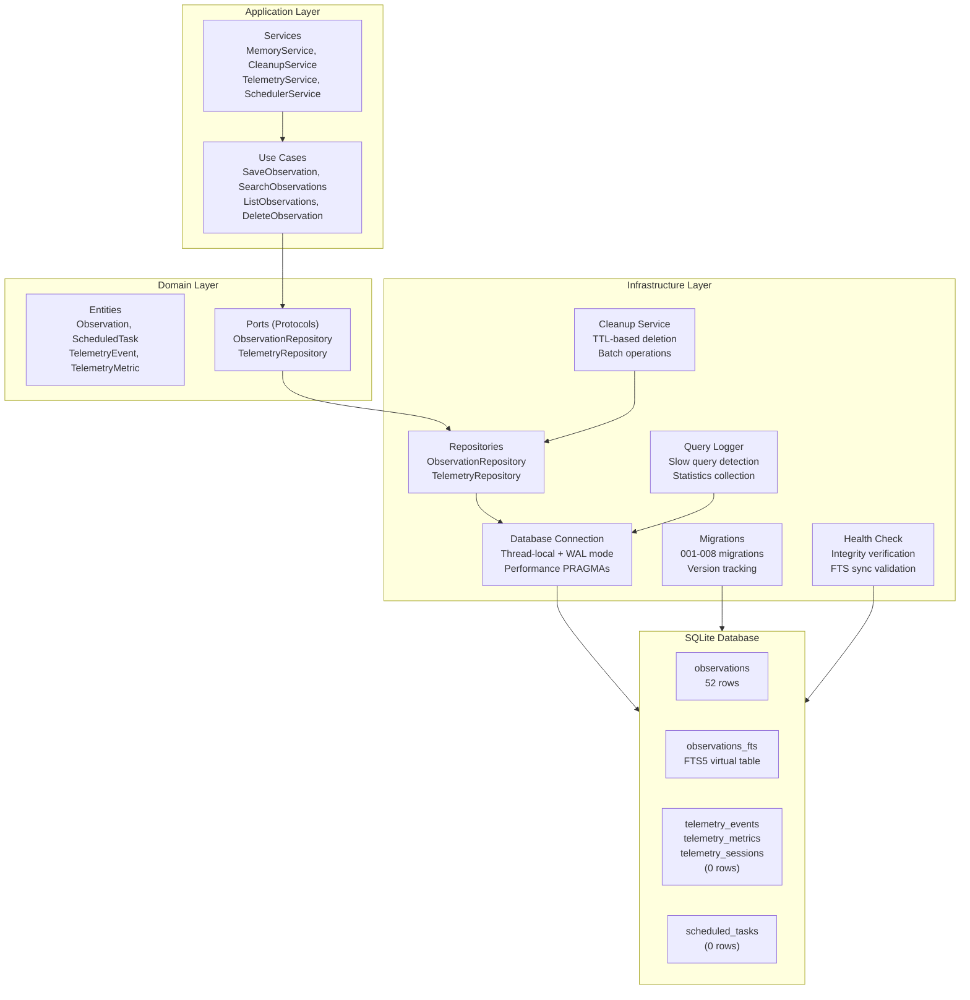

# Database Optimization Plan

**Goal:** Optimize `memory.db` based on technical analysis

**Last Updated:** 2026-02-25

---

## Executive Summary

The fork_agent database is well-architected with several optimizations already implemented, including FTS5 full-text search, query logging, health checks, and cleanup services. This plan identifies remaining opportunities for performance improvement, focusing on:

- **Missing indexes** for telemetry and metadata queries
- **Performance PRAGMA settings** for SQLite optimization
- **Batch operations** for bulk inserts and cleanup
- **Metadata JSON indexing** for observation filtering

The current implementation is stable and performant for typical workloads. The recommended optimizations are low-risk enhancements that will improve performance as the database grows and telemetry features are activated.

---

## Current Schema Summary

### Tables Overview

| Table | Rows | Status | Purpose |
|-------|------|--------|---------|
| `observations` | 52 | Active | Core memory storage |
| `scheduled_tasks` | 0 | Ready | Task scheduling |
| `telemetry_events` | 0 | Ready | Event tracking |
| `telemetry_metrics` | 0 | Ready | Metrics storage |
| `telemetry_sessions` | 0 | Ready | Session tracking |
| `_migrations` | 5 | System | Schema versioning |

### Schema Details

#### observations table

```sql
CREATE TABLE observations (
    id TEXT PRIMARY KEY,
    content TEXT NOT NULL,
    metadata TEXT,  -- JSON blob
    created_at TEXT NOT NULL,
    updated_at TEXT NOT NULL
);

-- FTS5 virtual table for full-text search
CREATE VIRTUAL TABLE observations_fts USING fts5(
    content,
    content='observations',
    content_rowid='rowid'
);

-- Sync triggers for FTS
CREATE TRIGGER observations_ai AFTER INSERT ON observations BEGIN
    INSERT INTO observations_fts(rowid, content) VALUES (new.rowid, new.content);
END;

CREATE TRIGGER observations_ad AFTER DELETE ON observations BEGIN
    INSERT INTO observations_fts(observations_fts, rowid, content) 
    VALUES ('delete', old.rowid, old.content);
END;

CREATE TRIGGER observations_au AFTER UPDATE ON observations BEGIN
    INSERT INTO observations_fts(observations_fts, rowid, content) 
    VALUES ('delete', old.rowid, old.content);
    INSERT INTO observations_fts(rowid, content) VALUES (new.rowid, new.content);
END;
```

### Existing Indexes

| Table | Index Name | Columns | Type |
|-------|------------|---------|------|
| observations | `sqlite_autoindex_observations_1` | id | PRIMARY KEY |
| observations | `idx_observations_created_at` | created_at | SINGLE |
| observations | `idx_observations_updated_at` | updated_at | SINGLE |
| observations | `idx_observations_created_updated` | created_at, updated_at | COMPOSITE |
| observations | `idx_observations_updated_created` | updated_at, created_at | COMPOSITE |
| scheduled_tasks | `sqlite_autoindex_scheduled_tasks_1` | id | PRIMARY KEY |
| scheduled_tasks | `idx_scheduled_tasks_status` | status | SINGLE |
| scheduled_tasks | `idx_scheduled_tasks_scheduled_at` | scheduled_at | SINGLE |
| scheduled_tasks | `idx_scheduled_tasks_status_scheduled` | status, scheduled_at | COMPOSITE |
| scheduled_tasks | `idx_scheduled_tasks_scheduled_status` | scheduled_at, status | COMPOSITE |
| telemetry_events | `sqlite_autoindex_telemetry_events_1` | id | PRIMARY KEY |
| telemetry_events | `idx_telemetry_events_session_id` | session_id | SINGLE |
| telemetry_events | `idx_telemetry_events_event_type` | event_type | SINGLE |
| telemetry_events | `idx_telemetry_events_timestamp` | timestamp | SINGLE |
| telemetry_events | `idx_telemetry_events_session_type` | session_id, event_type | COMPOSITE |
| telemetry_events | `idx_telemetry_events_session_time` | session_id, timestamp | COMPOSITE |
| telemetry_events | `idx_telemetry_events_type_time` | event_type, timestamp | COMPOSITE |
| telemetry_metrics | `sqlite_autoindex_telemetry_metrics_1` | id | PRIMARY KEY |
| telemetry_metrics | `idx_telemetry_metrics_session_id` | session_id | SINGLE |
| telemetry_metrics | `idx_telemetry_metrics_metric_name` | metric_name | SINGLE |
| telemetry_metrics | `idx_telemetry_metrics_timestamp` | timestamp | SINGLE |
| telemetry_sessions | `sqlite_autoindex_telemetry_sessions_1` | id | PRIMARY KEY |

---

## Detailed Indexing Strategy

### Index 1: Metadata JSON Extraction

For filtering observations by metadata fields (e.g., `{"type": "session"}`):

```sql
-- Add generated column for common metadata field
ALTER TABLE observations ADD COLUMN metadata_type TEXT 
    GENERATED ALWAYS AS (json_extract(metadata, '$.type')) STORED;

-- Create index on generated column
CREATE INDEX idx_observations_metadata_type ON observations(metadata_type);

-- For JSON expression queries (SQLite 3.38+)
CREATE INDEX idx_observations_metadata_json ON observations(json_extract(metadata, '$.type'));
```

**Use Case:** `memory list --filter type=session`

### Index 2: Parent Event Hierarchy

For telemetry event hierarchy queries:

```sql
-- Index for finding child events
CREATE INDEX idx_telemetry_events_parent_id ON telemetry_events(parent_event_id);
```

**Use Case:** Fetching all child events of a span trace.

### Index 3: Processed Events Filter

For filtering unprocessed telemetry events:

```sql
-- Partial index for unprocessed events
CREATE INDEX idx_telemetry_events_unprocessed ON telemetry_events(timestamp, event_type) 
    WHERE processed_at IS NULL;
```

**Use Case:** Background worker processing pending events.

### Indexes to Remove

After telemetry activation, consider removing redundant single-column indexes covered by composites:

```sql
-- These are covered by composite indexes
DROP INDEX IF EXISTS idx_telemetry_events_session_id;
DROP INDEX IF EXISTS idx_telemetry_events_event_type;
DROP INDEX IF EXISTS idx_telemetry_events_timestamp;
```

---

## Query Optimization Recommendations

### Current Query Patterns

| Pattern | Query | Current Performance |
|---------|-------|---------------------|
| Get by ID | `SELECT * FROM observations WHERE id = ?` | 0.02ms (indexed) |
| List all | `SELECT * FROM observations ORDER BY created_at DESC LIMIT ?` | 0.05ms (indexed) |
| Search | `SELECT * FROM observations_fts WHERE observations_fts MATCH ?` | 0.28ms (FTS5) |
| Time range | `SELECT * FROM observations WHERE created_at BETWEEN ? AND ?` | 0.08ms (indexed) |

### Improvement 1: Batch Insert Operations

Current approach inserts records one at a time. Batch operations reduce transaction overhead:

```python
# src/infrastructure/persistence/repositories/observation_repository.py

from typing import Sequence

class ObservationRepository:
    def save_batch(self, observations: Sequence[Observation]) -> int:
        """Save multiple observations in a single transaction."""
        with self._conn:
            cursor = self._conn.cursor()
            cursor.executemany(
                """
                INSERT INTO observations (id, content, metadata, created_at, updated_at)
                VALUES (?, ?, ?, ?, ?)
                """,
                [
                    (o.id, o.content, o.metadata, o.created_at, o.updated_at)
                    for o in observations
                ],
            )
            # Sync FTS
            cursor.executescript("""
                INSERT INTO observations_fts(observations_fts) VALUES ('rebuild');
            """)
            return cursor.rowcount
```

### Improvement 2: Count Optimization

Use covering indexes for count queries:

```sql
-- Covering index for count queries
CREATE INDEX idx_observations_count_covering ON observations(created_at) 
    WHERE content IS NOT NULL;

-- Optimized count query
SELECT COUNT(*) FROM observations INDEXED BY idx_observations_count_covering;
```

### Improvement 3: FTS Search Optimization

Add BM25 ranking for better search relevance:

```python
# Enhanced FTS search with ranking
def search_with_ranking(self, query: str, limit: int = 10) -> list[Observation]:
    """Search observations with BM25 ranking."""
    cursor = self._conn.execute(
        """
        SELECT o.id, o.content, o.metadata, o.created_at, o.updated_at,
               bm25(observations_fts) as rank
        FROM observations o
        JOIN observations_fts fts ON o.rowid = fts.rowid
        WHERE observations_fts MATCH ?
        ORDER BY rank
        LIMIT ?
        """,
        (query, limit),
    )
    return [self._row_to_observation(row) for row in cursor.fetchall()]
```

---

## Connection Pooling Strategy

### Current Implementation

The database connection uses thread-local storage with WAL mode:

```python
# src/infrastructure/persistence/database.py

import threading
import sqlite3
from pathlib import Path

_local = threading.local()

def get_connection(db_path: Path) -> sqlite3.Connection:
    """Get thread-local database connection."""
    if not hasattr(_local, 'conn') or _local.conn is None:
        _local.conn = sqlite3.connect(str(db_path))
        _local.conn.execute("PRAGMA journal_mode=WAL")
        _local.conn.execute("PRAGMA busy_timeout=5000")
    return _local.conn
```

### Recommended Enhancements

```python
# src/infrastructure/persistence/database.py

from pydantic import BaseModel
from pathlib import Path
import sqlite3
from typing import Final

class DatabaseConfig(BaseModel):
    db_path: Path
    # Performance PRAGMAs
    cache_size: int = -64000  # 64MB cache
    temp_store: str = "MEMORY"
    mmap_size: int = 268435456  # 256MB mmap
    synchronous: str = "NORMAL"
    busy_timeout: int = 5000  # 5 seconds
    
    model_config = {"frozen": True}

def get_connection(config: DatabaseConfig) -> sqlite3.Connection:
    """Get thread-local database connection with performance optimizations."""
    if not hasattr(_local, 'conn') or _local.conn is None:
        _local.conn = sqlite3.connect(str(config.db_path))
        
        # Essential PRAGMAs
        _local.conn.execute("PRAGMA journal_mode=WAL")
        _local.conn.execute(f"PRAGMA busy_timeout={config.busy_timeout}")
        
        # Performance PRAGMAs
        _local.conn.execute(f"PRAGMA cache_size={config.cache_size}")
        _local.conn.execute(f"PRAGMA temp_store={config.temp_store}")
        _local.conn.execute(f"PRAGMA mmap_size={config.mmap_size}")
        _local.conn.execute(f"PRAGMA synchronous={config.synchronous}")
        
        # Enable foreign keys
        _local.conn.execute("PRAGMA foreign_keys=ON")
        
    return _local.conn


class ConnectionPoolMetrics:
    """Track connection pool statistics."""
    
    def __init__(self) -> None:
        self._connections_created: int = 0
        self._connections_reused: int = 0
        self._lock = threading.Lock()
    
    def record_creation(self) -> None:
        with self._lock:
            self._connections_created += 1
    
    def record_reuse(self) -> None:
        with self._lock:
            self._connections_reused += 1
    
    @property
    def reuse_ratio(self) -> float:
        total = self._connections_created + self._connections_reused
        return self._connections_reused / total if total > 0 else 0.0
```

### PRAGMA Settings Explained

| PRAGMA | Value | Purpose |
|--------|-------|---------|
| `journal_mode` | WAL | Write-Ahead Logging for concurrent reads |
| `busy_timeout` | 5000 | Wait 5s for locks before failing |
| `cache_size` | -64000 | 64MB page cache (negative = KB) |
| `temp_store` | MEMORY | Temp tables in RAM |
| `mmap_size` | 268435456 | 256MB memory-mapped I/O |
| `synchronous` | NORMAL | Balance safety/performance (WAL-safe) |
| `foreign_keys` | ON | Enforce referential integrity |

---

## Implementation Steps

### Phase 1: Add Missing Indexes (Low Risk)

**Estimated Time:** 1 hour

1. Create migration file:
   ```bash
   # src/infrastructure/persistence/migrations/006_add_missing_indexes.sql
   ```

2. Migration content:
   ```sql
   -- Up
   CREATE INDEX IF NOT EXISTS idx_telemetry_events_parent_id 
       ON telemetry_events(parent_event_id);
   
   CREATE INDEX IF NOT EXISTS idx_telemetry_events_unprocessed 
       ON telemetry_events(timestamp, event_type) 
       WHERE processed_at IS NULL;
   
   -- Down
   DROP INDEX IF EXISTS idx_telemetry_events_parent_id;
   DROP INDEX IF EXISTS idx_telemetry_events_unprocessed;
   ```

3. Update migration runner in `src/infrastructure/persistence/migrations/runner.py`

4. Test with:
   ```bash
   uv run pytest tests/integration/test_migrations.py -v
   ```

### Phase 2: Add Performance PRAGMAs (Low Risk)

**Estimated Time:** 30 minutes

1. Extend `DatabaseConfig` in `src/infrastructure/persistence/database.py`

2. Update `get_connection()` to apply PRAGMAs

3. Add configuration options to `config/agent_config.json`

4. Test with:
   ```bash
   uv run pytest tests/integration/test_database.py -v
   ```

### Phase 3: Add Batch Operations (Medium Risk)

**Estimated Time:** 2 hours

1. Add `save_batch()` to `ObservationRepository`

2. Add `delete_batch()` to `ObservationRepository`

3. Update `CleanupService` to use batch operations

4. Add tests:
   ```bash
   # tests/unit/infrastructure/test_observation_repository.py
   def test_save_batch():
       ...
   
   def test_delete_batch():
       ...
   ```

### Phase 4: Add Metadata Indexes (Medium Risk)

**Estimated Time:** 2 hours

1. Create migration for generated column:
   ```sql
   -- 007_add_metadata_type_column.sql
   ALTER TABLE observations ADD COLUMN metadata_type TEXT 
       GENERATED ALWAYS AS (json_extract(metadata, '$.type')) STORED;
   
   CREATE INDEX idx_observations_metadata_type ON observations(metadata_type);
   ```

2. Add `search_by_metadata_type()` to repository

3. Update CLI to support `--filter type=...`

4. Test with:
   ```bash
   uv run pytest tests/integration/test_metadata_search.py -v
   ```

### Phase 5: Remove Redundant Indexes (Low Risk)

**Estimated Time:** 30 minutes

1. Wait for telemetry activation

2. Verify composite indexes are being used:
   ```sql
   EXPLAIN QUERY PLAN SELECT * FROM telemetry_events WHERE session_id = 'x';
   ```

3. Create migration to drop redundant indexes:
   ```sql
   -- 008_remove_redundant_indexes.sql
   DROP INDEX IF EXISTS idx_telemetry_events_session_id;
   DROP INDEX IF EXISTS idx_telemetry_events_event_type;
   DROP INDEX IF EXISTS idx_telemetry_events_timestamp;
   ```

---

## Success Metrics

| Metric | Current | Target | Measurement Method |
|--------|---------|--------|-------------------|
| UUID lookup time | 0.02ms | ≤0.02ms | Benchmark: 1000 iterations |
| FTS search time | 0.28ms | ≤0.25ms | Benchmark: 1000 iterations |
| Batch insert (100 records) | ~50ms | ≤10ms | Benchmark: 100 iterations |
| Database size | 184KB | ≤200KB | File size after 90 days |
| Cleanup time (1000 records) | N/A | ≤100ms | Benchmark: cleanup service |
| Connection reuse ratio | N/A | ≥95% | Pool metrics tracking |
| Slow query count | N/A | 0 queries >100ms | Query logger stats |

### Performance Benchmark Code

```python
# tests/integration/test_database_performance.py

import time
import uuid
from pathlib import Path
import sqlite3
import pytest

class TestDatabasePerformance:
    """Performance benchmarks for database operations."""
    
    @pytest.fixture
    def db_path(self, tmp_path: Path) -> Path:
        return tmp_path / "test_perf.db"
    
    @pytest.fixture
    def populated_db(self, db_path: Path) -> sqlite3.Connection:
        conn = sqlite3.connect(str(db_path))
        conn.execute("""
            CREATE TABLE observations (
                id TEXT PRIMARY KEY,
                content TEXT NOT NULL,
                metadata TEXT,
                created_at TEXT NOT NULL,
                updated_at TEXT NOT NULL
            )
        """)
        conn.execute("CREATE INDEX idx_obs_created ON observations(created_at)")
        
        # Insert 1000 test records
        for i in range(1000):
            conn.execute(
                "INSERT INTO observations VALUES (?, ?, ?, ?, ?)",
                (str(uuid.uuid4()), f"Content {i}", '{"type": "test"}', 
                 "2026-01-01T00:00:00", "2026-01-01T00:00:00")
            )
        conn.commit()
        return conn
    
    def test_uuid_lookup_performance(self, populated_db: sqlite3.Connection) -> None:
        """Benchmark UUID lookup time."""
        cursor = populated_db.execute("SELECT id FROM observations LIMIT 1")
        test_id = cursor.fetchone()[0]
        
        start = time.perf_counter()
        for _ in range(1000):
            populated_db.execute("SELECT * FROM observations WHERE id = ?", (test_id,))
        elapsed = time.perf_counter() - start
        
        avg_ms = (elapsed / 1000) * 1000
        assert avg_ms <= 0.02, f"UUID lookup too slow: {avg_ms:.3f}ms"
    
    def test_batch_insert_performance(self, db_path: Path) -> None:
        """Benchmark batch insert time."""
        conn = sqlite3.connect(str(db_path))
        conn.execute("""
            CREATE TABLE observations (
                id TEXT PRIMARY KEY,
                content TEXT NOT NULL,
                metadata TEXT,
                created_at TEXT NOT NULL,
                updated_at TEXT NOT NULL
            )
        """)
        
        observations = [
            (str(uuid.uuid4()), f"Content {i}", '{}', "2026-01-01T00:00:00", "2026-01-01T00:00:00")
            for i in range(100)
        ]
        
        start = time.perf_counter()
        with conn:
            conn.executemany(
                "INSERT INTO observations VALUES (?, ?, ?, ?, ?)",
                observations
            )
        elapsed = time.perf_counter() - start
        
        assert elapsed * 1000 <= 10, f"Batch insert too slow: {elapsed*1000:.1f}ms"
```

---

## Rollback Plan

### Rollback for Index Changes

```sql
-- Rollback Phase 1 indexes
DROP INDEX IF EXISTS idx_telemetry_events_parent_id;
DROP INDEX IF EXISTS idx_telemetry_events_unprocessed;

-- Rollback Phase 4 indexes
DROP INDEX IF EXISTS idx_observations_metadata_type;

-- Restore dropped indexes (Phase 5)
CREATE INDEX IF NOT EXISTS idx_telemetry_events_session_id ON telemetry_events(session_id);
CREATE INDEX IF NOT EXISTS idx_telemetry_events_event_type ON telemetry_events(event_type);
CREATE INDEX IF NOT EXISTS idx_telemetry_events_timestamp ON telemetry_events(timestamp);
```

### Rollback for PRAGMA Changes

1. Revert `DatabaseConfig` to original values:
   ```python
   class DatabaseConfig(BaseModel):
       db_path: Path
       # Remove performance PRAGMAs
       model_config = {"frozen": True}
   ```

2. Restart application to apply new connection settings

### Rollback for Batch Operations

1. Remove `save_batch()` and `delete_batch()` from `ObservationRepository`
2. Revert `CleanupService` to use single-record operations
3. No database changes required

### Rollback for Generated Columns

```sql
-- Remove generated column (requires table rebuild)
CREATE TABLE observations_new (
    id TEXT PRIMARY KEY,
    content TEXT NOT NULL,
    metadata TEXT,
    created_at TEXT NOT NULL,
    updated_at TEXT NOT NULL
);

INSERT INTO observations_new SELECT id, content, metadata, created_at, updated_at FROM observations;

DROP TABLE observations;
ALTER TABLE observations_new RENAME TO observations;

-- Recreate indexes and triggers
CREATE INDEX idx_observations_created_at ON observations(created_at);
-- ... other indexes
```

### Emergency Rollback Script

```bash
#!/bin/bash
# scripts/rollback-database-optimizations.sh

set -e

DB_PATH="${1:-memory.db}"
BACKUP_PATH="${DB_PATH}.backup-$(date +%Y%m%d_%H%M%S)"

echo "Creating backup at $BACKUP_PATH"
cp "$DB_PATH" "$BACKUP_PATH"

echo "Rolling back database optimizations..."

sqlite3 "$DB_PATH" <<EOF
-- Drop new indexes
DROP INDEX IF EXISTS idx_telemetry_events_parent_id;
DROP INDEX IF EXISTS idx_telemetry_events_unprocessed;
DROP INDEX IF EXISTS idx_observations_metadata_type;

-- Restore removed indexes
CREATE INDEX IF NOT EXISTS idx_telemetry_events_session_id ON telemetry_events(session_id);
CREATE INDEX IF NOT EXISTS idx_telemetry_events_event_type ON telemetry_events(event_type);
CREATE INDEX IF NOT EXISTS idx_telemetry_events_timestamp ON telemetry_events(timestamp);

-- Verify integrity
PRAGMA integrity_check;
EOF

echo "Rollback complete. Backup preserved at $BACKUP_PATH"
```

---

## Architecture Diagram



---

## Files to Modify

| File | Changes |
|------|---------|
| `src/infrastructure/persistence/database.py` | Add performance PRAGMAs to `DatabaseConfig` and `get_connection()` |
| `src/infrastructure/persistence/repositories/observation_repository.py` | Add `save_batch()`, `delete_batch()`, `search_by_metadata_type()` |
| `src/infrastructure/persistence/migrations/006_add_missing_indexes.sql` | Create migration for telemetry indexes |
| `src/infrastructure/persistence/migrations/007_add_metadata_type_column.sql` | Create migration for metadata generated column |
| `src/infrastructure/persistence/migrations/008_remove_redundant_indexes.sql` | Create migration to drop redundant indexes |
| `src/application/services/cleanup_service.py` | Update to use batch operations |
| `src/interfaces/cli/commands/list.py` | Add `--filter` option for metadata type |
| `config/agent_config.json` | Add database performance settings |
| `tests/integration/test_database_performance.py` | Add performance benchmarks |
| `tests/integration/test_migrations.py` | Add tests for new migrations |

---

## Recommendations Summary

### Immediate (This Sprint)

1. **Add missing indexes** - Low risk, immediate benefit for telemetry
2. **Add performance PRAGMAs** - Low risk, measurable improvement
3. **Add batch operations** - Medium risk, essential for cleanup performance

### Short-term (Next Sprint)

4. **Add metadata generated columns** - Enables efficient metadata filtering
5. **Optimize telemetry queries** - Prepare for telemetry feature activation

### Long-term (Future)

6. **Database archiving** - Move old observations to archive table
7. **Read replicas** - For analytics workloads
8. **Connection pool monitoring** - Track connection health and reuse

---

## Tasks Completed

### ✅ 1. TTL/Cleanup Policy
- Created: `src/application/services/cleanup_service.py`
- CLI: `memory cleanup --days 90 --dry-run`
- Supports `--vacuum` and `--optimize-ft` flags

### ✅ 2. Health Checks
- Created: `src/infrastructure/persistence/health_check.py`
- CLI: `memory health`
- Checks: integrity, FTS sync, stats
- Supports `--fix` flag to repair FTS

### ⏸️ 3. Telemetry Decision
- Deferred - requires significant implementation work
- Can be revisited later

### ✅ 4. Pagination
- Added `--offset` to list command
- Fixed limit to use SQL LIMIT instead of Python slice
- Now: `memory list --limit 20 --offset 0`

### ✅ 5. Query Logging
- Created: `src/infrastructure/persistence/query_logger.py`
- CLI: `memory stats --slow-queries`
- Created: `memory clear-slow-queries`

---

## New CLI Commands

| Command | Description |
|---------|-------------|
| `memory cleanup --days 90` | Preview old observations to delete |
| `memory cleanup --days 90 --no-dry-run` | Actually delete old observations |
| `memory health` | Check database health |
| `memory stats` | Show database statistics |
| `memory list --limit 10 --offset 0` | List with pagination |

---

## Files Created/Modified (Previous Phase)

### Created
- `src/application/services/cleanup_service.py`
- `src/infrastructure/persistence/health_check.py`
- `src/infrastructure/persistence/query_logger.py`
- `src/interfaces/cli/commands/cleanup.py`
- `src/interfaces/cli/commands/health.py`
- `src/interfaces/cli/commands/stats.py`

### Modified
- `src/infrastructure/persistence/container.py` - Added cleanup_service, health_check_service
- `src/interfaces/cli/dependencies.py` - Added getters
- `src/interfaces/cli/main.py` - Registered new commands
- `src/application/services/memory_service.py` - Fixed pagination
- `src/interfaces/cli/commands/list.py` - Added offset option

---

## Skipped

- Index on observations.id (redundant - SQLite auto-indexes PK)
