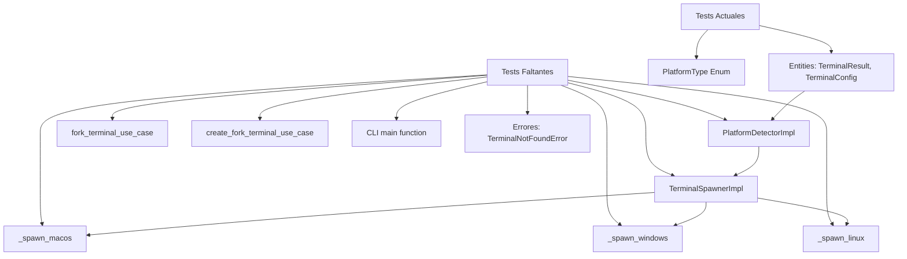
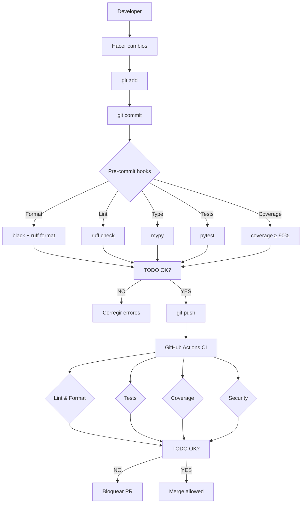

# Análisis de Arquitectura y Plan de Mejora

## 📊 Estado Actual de la Arquitectura

### Arquitectura Actual (Domain-Driven Design)

```
┌─────────────────────────────────────────────────────────────────────────────┐
│                           fork_agent                                          │
├─────────────────────────────────────────────────────────────────────────────┤
│                                                                               │
│  ┌─────────────────────────────────────────────────────────────────────┐    │
│  │                    INTERFACES (CLI)                                   │    │
│  │   ┌───────────────────────────────────────────────────────────┐     │    │
│  │   │                    fork.py                                 │     │    │
│  │   │   - main() - Entry point                                    │     │    │
│  │   └───────────────────────────────────────────────────────────┘     │    │
│  └─────────────────────────────────────────────────────────────────────┘    │
│                                    │                                         │
│                                    ▼                                         │
│  ┌─────────────────────────────────────────────────────────────────────┐    │
│  │                 APPLICATION (Use Cases & Services)                  │    │
│  │   ┌───────────────────────────┐  ┌─────────────────────────────────┐ │    │
│  │   │      Use Cases            │  │          Services               │ │    │
│  │   │  - fork_terminal.py       │  │  - platform_detector.py         │ │    │
│  │   │    • fork_terminal_use_case│  │    • PlatformDetector (ABC)     │ │    │
│  │   │    • create_fork_terminal │  │    • PlatformDetectorImpl       │ │    │
│  │   │                           │  │  - terminal_spawner.py          │ │    │
│  │   └───────────────────────────┘  │    • TerminalSpawner (ABC)      │ │    │
│  │                                    │    • TerminalSpawnerImpl         │ │    │
│  │                                    └─────────────────────────────────┘ │    │
│  └─────────────────────────────────────────────────────────────────────┘    │
│                                    │                                         │
│                                    ▼                                         │
│  ┌─────────────────────────────────────────────────────────────────────┐    │
│  │                     DOMAIN (Entities & Exceptions)                   │    │
│  │   ┌───────────────────────────────────────────────────────────────┐   │    │
│  │   │  entities/terminal.py                                         │   │    │
│  │   │    • PlatformType (Enum)                                      │   │    │
│  │   │    • TerminalResult (Dataclass frozen)                        │   │    │
│  │   │    • TerminalConfig (Dataclass frozen)                         │   │    │
│  │   │    • TerminalInfo (Dataclass frozen)                          │   │    │
│  │   │                                                              │   │    │
│  │   │  exceptions/terminal.py                                        │   │    │
│  │   │    • TerminalNotFoundError                                    │   │    │
│  │   └───────────────────────────────────────────────────────────────┘   │    │
│  └─────────────────────────────────────────────────────────────────────┘    │
│                                    │                                         │
│                                    ▼                                         │
│  ┌─────────────────────────────────────────────────────────────────────┐    │
│  │                  INFRASTRUCTURE (Config)                             │    │
│  │   ┌───────────────────────────────────────────────────────────────┐   │    │
│  │   │  config/                                                       │   │    │
│  │   │  platform/                                                     │   │    │
│  │   └───────────────────────────────────────────────────────────────┘   │    │
│  └─────────────────────────────────────────────────────────────────────┘    │
│                                                                               │
└─────────────────────────────────────────────────────────────────────────────┘
```

### Puntos Fuertes de la Arquitectura Actual

1. **DDD bien aplicado**: Separación clara de responsabilidades por capas
2. **Inversión de dependencias**: Uso de ABCs (Abstract Base Classes)
3. **Inmutabilidad**: Uso de `@dataclass(frozen=True)` para entidades
4. **Type hints**: Todo el código tiene type annotations
5. **Configuración de calidad**: `pyproject.toml`, `pre-commit-config.yaml`, `Makefile`

---

## 🔍 Análisis de Cobertura de Testing

### Estado Actual

| Categoría | Archivos | Coverage Estimado |
|-----------|----------|-------------------|
| **Domain** | 1 archivo | ~100% |
| **Application Services** | 2 archivos | 0% |
| **Application Use Cases** | 1 archivo | 0% |
| **Interfaces** | 1 archivo | 0% |
| **Infrastructure** | 0 archivos | N/A |

### Tests Existentes

```
tests/
├── __init__.py
├── conftest.py              ← Fixtures bien definidos
├── unit/
│   └── domain/
│       └── test_entities.py ← Solo cubre TerminalResult y TerminalConfig
└── integration/             ← Vacío
```

### Brechas Críticas de Testing



---

## 🪝 Análisis de Hooks Pre-commit y PR

### Configuración Actual (`.pre-commit-config.yaml`)

| Nivel | Hooks | Estado |
|-------|-------|--------|
| **INFO** | trailing-whitespace, end-of-file-fixer, check-yaml, check-added-large-files, detect-private-key | ✅ |
| **WARN** | black, ruff-format | ✅ |
| **ERROR** | ruff (linter), mypy (type checker) | ✅ |
| **OPTIONAL** | isort | ✅ |

### Falta en la Configuración Actual

```yaml
# ❌ NO INCLUIDOS:
- pytest (validar tests antes de commit)
- coverage-check (validar coverage mínimo)
- secret-scanner (gitleaks/trufflehog)
- commitlint (validar mensajes de commit)
```

---

## 📋 Plan de Acción

### Fase 1: Aumentar Cobertura de Tests (Prioridad ALTA)

```
tests/unit/
├── domain/
│   ├── test_entities.py          [COMPLETAR]
│   │   └── TerminalInfo tests
│   └── test_exceptions.py       [CREAR]
│       └── TerminalNotFoundError tests
│
├── application/
│   ├── test_use_cases.py        [CREAR]
│   │   ├── fork_terminal_use_case tests
│   │   └── create_fork_terminal_use_case tests
│   │
│   └── services/
│       ├── test_platform_detector.py  [CREAR]
│       │   ├── PlatformDetectorImpl tests
│       │   └── Mock platform detection
│       │
│       └── test_terminal_spawner.py   [CREAR]
│           ├── _spawn_macos tests
│           ├── _spawn_windows tests
│           ├── _spawn_linux tests
│           └── TerminalNotFoundError handling
│
└── interfaces/
    └── cli/
        └── test_fork.py          [CREAR]
            └── main() function tests
```

### Fase 2: Mejora de Hooks Pre-commit

```yaml
# .pre-commit-config.yaml - ADICIONES

# AGREGAR AL FINAL:
  # ═══════════════════════════════════════════════════════
  # NIVEL ERROR: Tests obligatorios
  # ═══════════════════════════════════════════════
  - repo: local
    hooks:
      - id: pytest
        name: Run tests (pytest)
        description: Ejecuta tests unitarios antes del commit
        entry: pytest tests/ -v --tb=short --no-cov -q
        language: system
        pass_filenames: false
        stages: [pre-commit]
        always_run: true  # Ejecutar incluso si no hay cambios

  # ═══════════════════════════════════════════════════════
  # NIVEL ERROR: Coverage mínimo obligatorio
  # ═══════════════════════════════════════════════
  - repo: local
    hooks:
      - id: coverage-check
        name: Check coverage (90%)
        description: Verifica coverage mínimo del 90%
        entry: pytest tests/ --cov=src --cov-report=term-missing --cov-fail-under=90
        language: system
        pass_filenames: false
        stages: [pre-commit]
        always_run: true
```

### Fase 3: GitHub Actions para Pull Requests

```yaml
# .github/workflows/ci.yml - CREAR

name: CI Pipeline

on:
  push:
    branches: [main, develop]
  pull_request:
    branches: [main, develop]

jobs:
  lint-and-format:
    runs-on: ubuntu-latest
    steps:
      - uses: actions/checkout@v4
      - uses: actions/setup-python@v5
        with:
          python-version: '3.11'
      - run: pip install -e ".[dev]"
      - run: make lint
      - run: make format
      - run: make typecheck

  tests:
    runs-on: ubuntu-latest
    strategy:
      matrix:
        os: [ubuntu-latest, macos-latest, windows-latest]
    steps:
      - uses: actions/checkout@v4
      - uses: actions/setup-python@v5
        with:
          python-version: '3.11'
      - run: pip install -e ".[dev]"
      - run: pytest tests/ --cov=src -v
      
      - name: Upload coverage
        if: matrix.os == 'ubuntu-latest'
        uses: codecov/codecov-action@v3

  security:
    runs-on: ubuntu-latest
    steps:
      - uses: actions/checkout@v4
      - name: Run bandit (security linter)
        run: pip install bandit && bandit -r src/
      - name: Run safety (vulnerability scanner)
        run: pip install safety && safety check
```

---

## 🎯 Métricas y Metas de Cobertura

### Meta de Cobertura por Componente

| Componente | Meta Mínima | Meta Ideal |
|------------|-------------|------------|
| **Domain Entities** | 100% | 100% |
| **Domain Exceptions** | 100% | 100% |
| **Application Use Cases** | 90% | 100% |
| **Application Services** | 85% | 95% |
| **Interfaces CLI** | 80% | 90% |
| **Total Project** | 90% | 95% |

### Reglas de Calidad

```
┌─────────────────────────────────────────────────────────────────┐
│                    GATE DE CALIDAD                               │
├─────────────────────────────────────────────────────────────────┤
│                                                                 │
│  PRE-COMMIT:                                                    │
│  ├── ✅ Format check (black + ruff)                             │
│  ├── ✅ Lint check (ruff)                                       │
│  ├── ✅ Type check (mypy)                                       │
│  ├── ✅ Unit tests pass                                         │
│  └── ✅ Coverage ≥ 90%                                          │
│                                                                 │
│  PULL REQUEST:                                                  │
│  ├── ✅ Todos los pre-commit checks                             │
│  ├── ✅ Tests en todas las plataformas                          │
│  ├── ✅ Coverage no decrease                                     │
│  ├── ✅ Security scan pass                                       │
│  └── ✅ No hay nuevos mypy errors                                │
│                                                                 │
└─────────────────────────────────────────────────────────────────┘
```

---

## 📝 Lista de Tareas Detalladas

### Inmediatas (Esta Semana)

- [ ] Crear `tests/unit/domain/test_exceptions.py`
- [ ] Crear `tests/unit/application/test_use_cases.py`
- [ ] Crear `tests/unit/application/services/test_platform_detector.py`
- [ ] Crear `tests/unit/application/services/test_terminal_spawner.py`
- [ ] Crear `tests/unit/interfaces/cli/test_fork.py`

### Corto Plazo (2 Semanas)

- [ ] Actualizar `.pre-commit-config.yaml` con hooks de pytest y coverage
- [ ] Crear `.github/workflows/ci.yml`
- [ ] Configurar Codecov/GitHub Actions
- [ ] Actualizar `pyproject.toml` con configuraciones adicionales de coverage

### Mediano Plazo (1 Mes)

- [ ] Agregar tests de integración
- [ ] Agregar tests de propiedad con Hypothesis
- [ ] Implementar commitlint para mensajes de commit
- [ ] Agregar secret scanning (trufflehog/gitleaks)

---

## 🔄 Flujo de Trabajo Recomendado



---

## 📌 Recomendaciones Finales

1. **Iniciar con tests de servicios**: `TerminalSpawnerImpl` es crítico y no tiene tests
2. **Mockear dependencias**: Usar `unittest.mock` para las abstracciones
3. **Tests de plataformas**: Considerar tests condicionales para macOS/Windows/Linux
4. **Coverage gradual**: Si 90% es muy alto inicialmente, empezar con 70% e incrementar
5. **Documentar excepciones**: Cada test debe cubrir happy path y edge cases
6. **Pre-commit incremental**: Agregar hooks de a poco para no abrumar al equipo

---

*Documento generado: 2026-02-08*
*Versión: 1.0*
