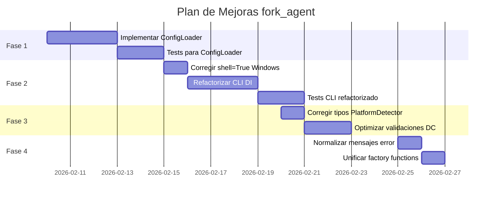

# Plan de Mejoras - Revisión Exhaustiva de Código

## 📋 Resumen Ejecutivo

Este documento presenta un plan secuencial para abordar los problemas identificados en la revisión exhaustiva del código Python en `src/`.

---

## 🔴 Problemas Críticos (Fase 1)

### 1. Infrastructure no implementada

| Aspecto | Detalle |
|---------|---------|
| **Archivo** | `src/infrastructure/config/__init__.py` |
| **Severidad** | CRÍTICO |
| **Esfuerzo** | ALTO |

**Problema**: La infraestructura de configuración está vacía, violando la arquitectura DDD.

**Acciones requeridas**:
- [ ] Implementar `ConfigLoader` basado en dotenv
- [ ] Agregar validación de variables de entorno
- [ ] Crear tests de integración para config

**Código base propuesto**:
```python
"""Configuración del proyecto."""

from pathlib import Path
from typing import Any

from dotenv import load_dotenv


class ConfigError(Exception):
    """Error de configuración."""
    pass


class ConfigLoader:
    """Carga y valida configuración del proyecto."""
    
    def __init__(self, env_path: Path | None = None) -> None:
        self._env_path = env_path or Path(__file__).parent.parent.parent / ".env"
        self._config: dict[str, Any] = {}
    
    def load(self) -> dict[str, Any]:
        """Carga variables de entorno."""
        if self._env_path.exists():
            load_dotenv(self._env_path)
        self._config = {
            "fork_agent_debug": self._get_bool("FORK_AGENT_DEBUG", False),
            "fork_agent_shell": self._get_str("FORK_AGENT_SHELL", "bash"),
        }
        return self._config
    
    def _get_str(self, key: str, default: str) -> str:
        return str(self._config.get(key) or default)
    
    def _get_bool(self, key: str, default: bool) -> bool:
        return self._config.get(key, str(default)).lower() == "true"
```

---

## 🟠 Problemas de Seguridad (Fase 2)

### 2. Inyección de Comandos en Windows

| Aspecto | Detalle |
|---------|---------|
| **Archivo** | `src/application/services/terminal/terminal_spawner.py:70` |
| **Severidad** | ALTO |
| **Esfuerzo** | BAJO |

**Problema**: Uso de `shell=True` permite inyección de comandos.

**Código actual**:
```python
subprocess.Popen(["cmd", "/c", "start", "cmd", "/k", command], shell=True)
```

**Corrección**:
```python
import subprocess

subprocess.Popen(
    ["cmd", "/c", "start", "cmd", "/k", command],
    creationflags=subprocess.CREATE_NEW_CONSOLE,
)
# O usar lista de argumentos sin shell
```

---

### 3. Dependencias Directas en CLI

| Aspecto | Detalle |
|---------|---------|
| **Archivo** | `src/interfaces/cli/fork.py` |
| **Severidad** | ALTO |
| **Esfuerzo** | MEDIO |

**Problema**: Imports directos de implementaciones concretas.

**Código actual**:
```python
from src.application.services.terminal.platform_detector import PlatformDetectorImpl
from src.application.services.terminal.terminal_spawner import TerminalSpawnerImpl
```

**Corrección propuesta**:
```python
"""CLI para bifurcar terminals."""

import sys
from typing import Callable

from src.domain.entities.terminal import TerminalResult


def create_fork_cli(
    detect_platform: Callable[[], str],
    spawn_terminal: Callable[[str], TerminalResult],
) -> Callable[[], int]:
    def main() -> int:
        if len(sys.argv) < 2:
            print("Uso: fork <comando>")
            return 1
        
        command = " ".join(sys.argv[1:])
        result = spawn_terminal(command)
        print(result.output)
        return result.exit_code
    
    return main
```

---

## 🟡 Problemas de Tipado (Fase 3)

### 4. PlatformDetector retorna string en lugar de PlatformType

| Aspecto | Detalle |
|---------|---------|
| **Archivo** | `src/application/services/terminal/platform_detector.py:23` |
| **Severidad** | MEDIO |
| **Esfuerzo** | BAJO |

**Problema**: Inconsistencia de tipos.

**Corrección**:
```python
from src.domain.entities.terminal import PlatformType

class PlatformDetectorImpl(PlatformDetector):
    def detect(self) -> PlatformType:
        """Detecta el sistema operativo actual."""
        return PlatformType(platform.system())
```

---

### 5. Validaciones redundantes en Dataclasses

| Aspecto | Detalle |
|---------|---------|
| **Archivo** | `src/domain/entities/terminal.py` |
| **Severidad** | MEDIO |
| **Esfuerzo** | MEDIO |

**Problema**: Validaciones en `__post_init__` son redundantes con type hints.

**Mejora propuesta** (opcional):
```python
from dataclasses import dataclass
from typing import Any

@dataclass(frozen=True)
class TerminalConfig:
    terminal: str | None
    platform: PlatformType
    
    def __post_init__(self) -> None:
        # Solo validar lógica de negocio, no tipos
        if self.terminal and not self.terminal.strip():
            raise ValueError("terminal cannot be empty")
```

---

## 🟢 Code Smells y Mejoras (Fase 4)

### 6. Normalización de Mensajes de Error

| Aspecto | Detalle |
|---------|---------|
| **Archivos** | Varios |
| **Severidad** | BAJO |
| **Esfuerzo** | BAJO |

**Problema**: Mezcla de español e inglés en mensajes.

**Acción**: Estandarizar a español (según contexto del proyecto).

---

### 7. Unificación de Factory Functions

| Aspecto | Detalle |
|---------|---------|
| **Archivo** | `src/application/use_cases/fork_terminal.py` |
| **Severidad** | BAJO |
| **Esfuerzo** | MEDIO |

**Problema**: Duplicación entre `fork_terminal_use_case` y `create_fork_terminal_use_case`.

**Mejora**:
```python
def create_fork_terminal_use_case(
    detect_platform: Callable[[], str],
    spawn_terminal: Callable[[str], TerminalResult],
) -> Callable[[str], TerminalResult]:
    """Factory unificado para crear use case."""
    def execute(command: str) -> TerminalResult:
        if not command.strip():
            raise ValueError("Command cannot be empty")
        platform_str = detect_platform()
        return spawn_terminal(command)
    return execute


# Alias para compatibilidad
fork_terminal_use_case = create_fork_terminal_use_case
```

---

## 📅 Roadmap de Implementación



---

## ✅ Lista de Verificación por Fase

### Fase 1: Infrastructure
- [ ] `ConfigLoader` implementado
- [ ] Tests unitarios para ConfigLoader
- [ ] Tests de integración
- [ ] Documentación actualizada
- [ ] Coverage ≥ 80%

### Fase 2: Seguridad y CLI
- [ ] `shell=True` eliminado
- [ ] CLI usa Dependency Injection
- [ ] Tests de CLI actualizados
- [ ] No hay warnings de mypy

### Fase 3: Tipado
- [ ] PlatformDetector retorna PlatformType
- [ ] Sin errores de mypy
- [ ] Imports organizados
- [ ] Type hints consistentes

### Fase 4: Limpieza
- [ ] Mensajes consistentes
- [ ] Factory functions unificadas
- [ ] Code smells eliminados
- [ ] Documentación mejorada

---

## 📊 Métricas de Progreso

| Fase | Archivos | Tests | Esfuerzo |
|------|----------|-------|----------|
| 1 | 2 | 8 | ALTO |
| 2 | 2 | 12 | MEDIO |
| 3 | 3 | 4 | BAJO |
| 4 | 4 | 0 | BAJO |

**Total estimado**: 2-3 semanas

---

*Documento generado: 2026-02-08*
*Versión: 1.0*
