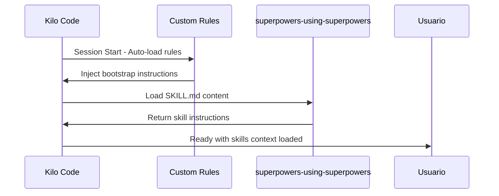

# Plan de Implementación: Bootstrap Automático de Superpowers

## Resumen Ejecutivo

Este plan describe cómo implementar la carga automática de la skill principal `superpowers-using-superpowers` al inicio de cada sesión en Kilo Code mediante Custom Rules.

---

## 1. Arquitectura de la Solución

### 1.1 Estructura de Archivos

```
.kilocode/
├── rules/                              # NUEVO - Custom Rules directory
│   └── superpowers-bootstrap.md        # Rule principal de bootstrap
└── skills/
    └── superpowers-using-superpowers/
        └── SKILL.md                    # Skill principal (ya existe)
```

### 1.2 Flujo de Carga



### 1.3 Mecanismo de Funcionamiento

1. **Kilo Code inicia sesión** → Lee automáticamente `.kilocode/rules/`
2. **Custom Rule se inyecta** → Forma parte del system prompt
3. **Rule fuerza verificación** → Ejecuta lógica de `mandatory_skill_check`
4. **Skill se carga** → Contenido de `superpowers-using-superpowers/SKILL.md` disponible

---

## 2. Contenido de la Rule

### 2.1 Archivo: `.kilocode/rules/superpowers-bootstrap.md`

```markdown
# Superpowers Bootstrap Rule

## Mandatory Skill Check - PRECONDITION

This rule is injected automatically at session start. It establishes the 
skill verification precondition that MUST be executed before ANY user-facing response.

### Skill Evaluation Protocol

**Step 1: Skill Evaluation**
- Evaluate the user request against ALL available skill descriptions
- Determine whether at least one skill clearly and unambiguously applies

**Step 2: Branching Decision**

<if_skill_applies>
- Select EXACTLY ONE skill
- Prefer the most specific skill when multiple skills match
- Read the full SKILL.md file at the skill location
- Load the SKILL.md contents fully into context BEFORE continuing
- Follow the SKILL.md instructions precisely
- Do NOT respond outside the skill-defined flow
</if_skill_applies>

<if_no_skill_applies>
- Proceed with a normal response
- Do NOT load any SKILL.md files
</if_no_skill_applies>

### Primary Skill: superpowers-using-superpowers

**Location:** `.kilocode/skills/superpowers-using-superpowers/SKILL.md`

**Description:** Use when starting any conversation - establishes how to find 
and use skills, requiring Skill tool invocation before ANY response including 
clarifying questions.

**Trigger Condition:** This skill applies to ALL tasks as it establishes the 
methodology for skill discovery and usage.

### Available Skills Reference

| Skill | Description | Trigger |
|-------|-------------|---------|
| superpowers-using-superpowers | Starting any conversation | Always check first |
| superpowers-brainstorming | Creative work, features, components | Before implementation |
| superpowers-writing-plans | Multi-step tasks with specs | Before touching code |
| superpowers-test-driven-development | Features or bugfixes | Before implementation code |
| superpowers-systematic-debugging | Bugs, test failures, unexpected behavior | Before proposing fixes |
| superpowers-verification-before-completion | Claiming work is complete | Before success claims |
| superpowers-requesting-code-review | Completing tasks, major features | Before merging |
| superpowers-executing-plans | Written implementation plan | When plan exists |
| superpowers-subagent-driven-development | Independent tasks in session | Parallel execution |

### Red Flags - STOP

These thoughts mean you are rationalizing and should check for skills:

| Thought | Reality |
|---------|---------|
| This is just a simple question | Questions are tasks. Check for skills. |
| I need more context first | Skill check comes BEFORE clarifying questions. |
| Let me explore the codebase first | Skills tell you HOW to explore. Check first. |
| This does not need a formal skill | If a skill exists, use it. |
| I will just do this one thing first | Check BEFORE doing anything. |

### Internal Verification

After completing the evaluation, internally confirm:
- skill_check_completed: true|false

### Constraints

- Do NOT load every SKILL.md up front
- Load SKILL.md ONLY after a skill is selected
- Do NOT skip this check
- FAILURE to perform this check is an error
```

---

## 3. Consideraciones de Compatibilidad

### 3.1 Relación con mandatory_skill_check Existente

El system prompt actual ya contiene un bloque `mandatory_skill_check`. La Custom Rule:

| Aspecto | System Prompt | Custom Rule |
|---------|---------------|-------------|
| Carga | Automática (core) | Automática (proyecto) |
| Modificable | No (core de Kilo Code) | Sí (proyecto) |
| Prioridad | Base | Extensión |
| Contenido | Genérico | Específico para superpowers |

**Estrategia:** La Custom Rule **complementa** el mandatory_skill_check existente:
- El system prompt establece el mecanismo genérico
- La Custom Rule proporciona la implementación específica para superpowers
- No hay conflicto porque la Rule **extiende** sin **duplicar**

### 3.2 Evitar Duplicación

La Rule NO debe:
- ❌ Copiar todo el contenido de `SKILL.md` (referenciarlo)
- ❌ Repetir el system prompt genérico palabra por palabra
- ❌ Crear un segundo mecanismo de skill check paralelo

La Rule SÍ debe:
- ✅ Proporcionar la lista de skills disponibles
- ✅ Establecer la skill principal a cargar
- ✅ Referenciar la ubicación del SKILL.md completo
- ✅ Ser concisa pero completa

### 3.3 Formato de Custom Rules

Según la documentación de Kilo Code:
- Formato: Markdown
- Ubicación: `.kilocode/rules/` (proyecto) o `~/.kilocode/rules/` (global)
- Carga: Automática al iniciar sesión
- Aplicación: A todas las interacciones

---

## 4. Pasos de Implementación

### Paso 1: Crear Directorio de Rules

```bash
mkdir -p .kilocode/rules
```

### Paso 2: Crear Archivo de Rule

Crear `.kilocode/rules/superpowers-bootstrap.md` con el contenido de la sección 2.1.

### Paso 3: Verificar Estructura

```bash
tree .kilocode/
# Expected output:
# .kilocode/
# ├── rules/
# │   └── superpowers-bootstrap.md
# └── skills/
#     └── superpowers-using-superpowers/
#         └── SKILL.md
```

### Paso 4: Probar Carga

1. Iniciar nueva sesión de Kilo Code
2. Verificar que la Rule se carga (debe aparecer en el contexto)
3. Ejecutar una tarea simple
4. Verificar que el skill check se ejecuta

---

## 5. Verificación

### 5.1 Verificación Manual

**Test 1: Verificar que la Rule existe**
```bash
cat .kilocode/rules/superpowers-bootstrap.md
```

**Test 2: Verificar estructura completa**
```bash
ls -la .kilocode/rules/
ls -la .kilocode/skills/superpowers-using-superpowers/
```

### 5.2 Verificación Funcional

**Test 3: Nueva sesión debe cargar la Rule**

Al iniciar Kilo Code, verificar que:
1. La sesión inicia sin errores
2. El contexto incluye las instrucciones de superpowers
3. El skill check se ejecuta antes de responder

**Test 4: Skill check funciona correctamente**

Ejecutar una tarea que claramente requiere una skill:
```
User: "Help me debug this failing test"
Expected: Agent should invoke superpowers-systematic-debugging skill
```

**Test 5: Skills se cargan correctamente**

Ejecutar una tarea creativa:
```
User: "I want to add a new feature for user authentication"
Expected: Agent should invoke superpowers-brainstorming skill first
```

### 5.3 Verificación de No-Conflictos

**Test 6: Sin duplicación**

Verificar que:
- No hay mensajes de error sobre instrucciones duplicadas
- El comportamiento es consistente
- No hay bucles infinitos de skill loading

---

## 6. Alternativas Consideradas

### 6.1 Wrapper Script (Descartada)

```bash
#!/bin/bash
kilo-code --prompt "$(cat .kilocode/skills/superpowers-using-superpowers/SKILL.md)"
```

**Problema:** Requiere intervención manual, no es automático.

### 6.2 Modo Personalizado (Descartada)

Crear un modo "superpowers" que incluya las instrucciones.

**Problema:** Requiere seleccionar el modo manualmente.

### 6.3 Custom Rules (Seleccionada)

**Ventajas:**
- ✅ Carga automática al iniciar sesión
- ✅ Aplica a todas las interacciones
- ✅ Modificable por proyecto
- ✅ Compatible con el sistema existente

---

## 7. Riesgos y Mitigaciones

| Riesgo | Probabilidad | Impacto | Mitigación |
|--------|--------------|---------|------------|
| Rule no se carga | Baja | Alto | Verificar ubicación correcta |
| Conflicto con system prompt | Muy Baja | Medio | Rule complementa, no duplica |
| Skill check muy verboso | Media | Bajo | Mantener Rule concisa |
| Rendimiento de inicio | Baja | Bajo | Rule es pequeña (~2KB) |

---

## 8. Próximos Pasos

1. **Implementar** la Custom Rule siguiendo los pasos de la sección 4
2. **Verificar** que la carga funciona correctamente
3. **Documentar** cualquier ajuste necesario
4. **Monitorear** el comportamiento en sesiones reales

---

## 9. Referencias

- [Kilo Code Custom Rules Documentation](docs/plans/kilo-code-vs-superpowers.md)
- [Skill: superpowers-using-superpowers](.kilocode/skills/superpowers-using-superpowers/SKILL.md)
- [Análisis de Alternativas](docs/plans/alternativas-kilocode.md)
- [Automatización en Kilo Code](docs/plans/automatizacion-kilocode.md)
