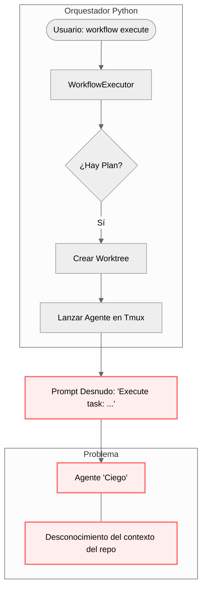
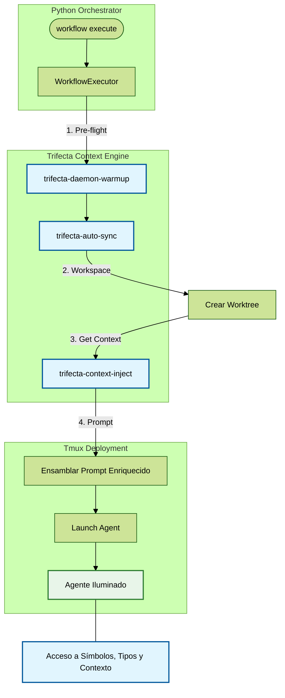

# Informe de Exploración: Integración de Trifecta v2 en el Orquestador Python

**Fecha**: 2026-04-23  
**Estado**: EXPLORACIÓN COMPLETADA  
**Arquitecto**: Gemini CLI  
**Objetivo**: Conectar el motor de contexto Trifecta con el flujo de ejecución de `memory workflow`.

## 1. Contexto y Problemática

Actualmente, el proyecto `tmux_fork` opera con una "doble personalidad" tecnológica:

1.  **Cara Shell (`tmux-live`)**: Ubicada en los scripts de la habilidad del usuario. Ya posee integración con Trifecta, inyectando contexto antes de lanzar agentes.
2.  **Cara Python (`memory workflow execute`)**: Ubicada en `src/interfaces/cli/commands/workflow.py`. Esta cara es **ciega** a Trifecta. Lanza agentes en tmux con prompts genéricos, forzando a la IA a explorar el repositorio de cero (gasto innecesario de tokens y tiempo).

## 2. Diagramas de Flujo de Datos

### Flujo de Ejecución Actual (Modo "Ciego")
En este estado, el `WorkflowExecutor` no tiene consciencia del grafo de conocimiento.

### Flujo de Ejecución Propuesto (Modo "Wired")
Conectamos los scripts de integración de la habilidad directamente en el ciclo de vida del `WorkflowExecutor`.

## 3. Puntos de Inyección Identificados

Tras auditar `src/application/services/workflow/executor.py`, estos son los puntos exactos para el "cableado":

| Fase | Método | Acción Técnica |
| :--- | :--- | :--- |
| **Pre-flight** | `execute_plan()` | Ejecutar `trifecta-daemon-warmup` y `trifecta-auto-sync` mediante `subprocess.run`. |
| **Enriquecimiento** | `execute_task()` | Invocar `trifecta-context-inject --task "{task.description}"` antes del spawn. |
| **Despliegue** | `execute_task()` | Concatenar el output de Trifecta al `prompt` que se envía a `self._tmux.launch_agent`. |
| **Persistencia** | `cleanup_worktree()` | Ejecutar `trifecta-session-log` para que la historia del agente quede en `_ctx/session_*.md`. |

## 4. Auditoría de Documentación (Source of Truth)

Existe una desincronización de identidad en el root:

*   **`AGENTS.md` (Root)**: Obsoleto (Feb 2026). No menciona Trifecta v2 ni las reglas de modelos pagados (`glm-5-turbo`).
*   **`SKILL.md` (Habilidad)**: Actualizado (Abril 2026). Contiene la verdadera sabiduría operativa.

**Plan de Acción Doc:** Sincronizar `SKILL.md` -> `AGENTS.md` y convertir `GEMINI.md`/`CLAUDE.md` en punteros ligeros.

## 5. Próximos Pasos Recomendados (Directivas)

1.  **Sincronizar AGENTS.md**: Actualizar la "Biblia" del repo para que cualquier agente sepa usar Trifecta.
2.  **Crear `ContextService`**: Implementar una clase ligera en Python que abstraiga las llamadas a los scripts de la habilidad.
3.  **Refactorizar `WorkflowExecutor`**: Inyectar el `ContextService` y activar el modo "Wired".

---
*Documento generado por el Arquitecto Gemini CLI en fase de exploración SDD.*
